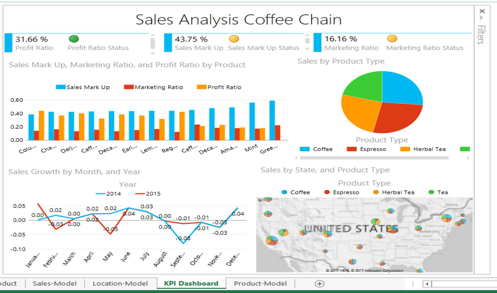
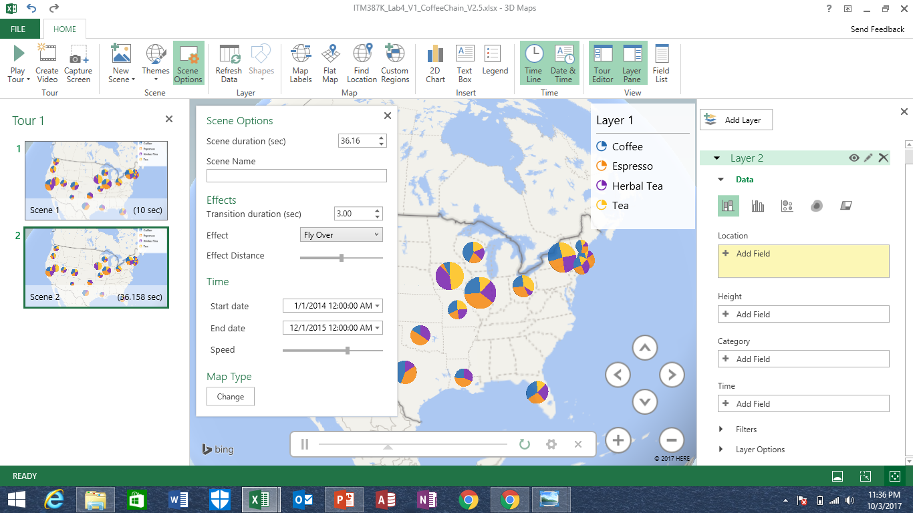
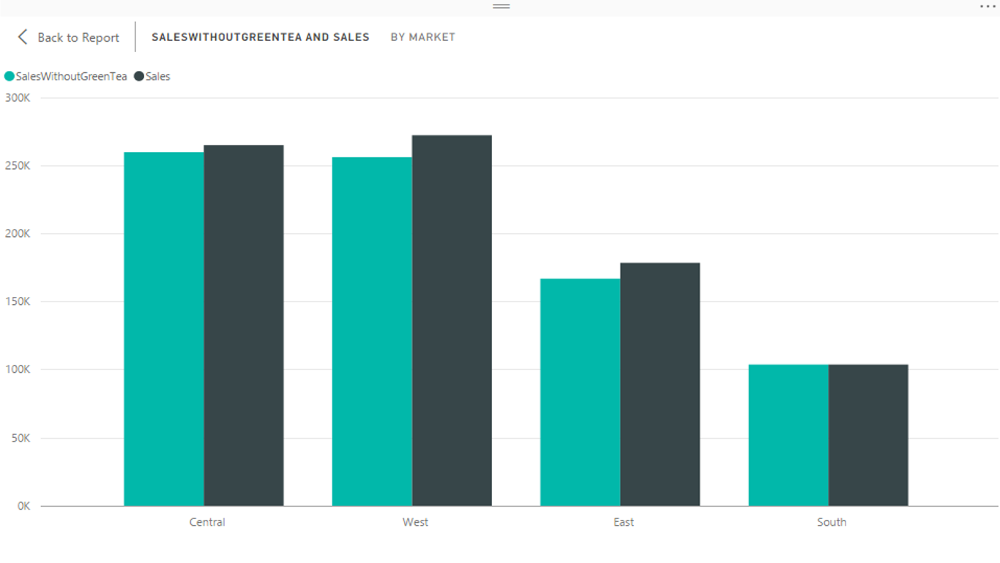

### URL: hlmes.github.io/itm387k

### Table of Contents

- General announcements
  - [Introduction](#introduction)
- Lab Assignments
  - [Lab4: Power BI in Excel](#lab-4-power-bi-in-excel) --- Updated 10/3
  - [Lab3b: Power BI - Part II](#lab-3b-power-bi---part-2) --- Updated 9/21
  - [Lab3a: Power BI - Part I](#lab-3a-power-bi---part-1) --- Updated 9/19
  - [Lab 2: Tableau - Part II](#lab-2-tableau---part-2)
  - [Lab 1: Tableau - Part I](#lab-1-tableau---part-1) --- Updated 9/20
- BI Concepts
  - [BI Concept (9/29)](#bi-concept-of-the-week-929) ---new
  - [BI Concept (9/22)](#bi-concept-of-the-week-922)
  - [BI Concept (9/13)](#bi-concept-of-the-week-913)


# BI Concept of the week (9/29)

## Cross-Disciplinary Collaboration

Looking at the [2017 Business Trends](https://bi-survey.com/top-business-intelligence-trends-2017), we notice an increased importance in BI collaboration, for a good reason. As you have noticed during your Lab 3b, topic specific analyses can become difficult if one isn't yet familiar with operation procedures, objectives, goals, etc. of the topic of your analysis. At other times, you may be very familiar with the topic and know excactly which KPI's to compute, but aren't quite sure how to compute them. Although I'm sure each of you can learn all of the above, often you simply don't have the time.

Both cases illustrate the beauty of cross-disciplinary collaboration in visual analytics. People with various skills and backgrounds (e.g. marketing, sales, management, engineering, IT, statistics, etc.) will observe different aspects in identical vizzes. Combining your resources and performing the Visual BI analysis collaboratively can thus be a powerful approach to creating powerful BI analytics results.

Don't be shy and **seek collaboration** with peers from different fields and backgrounds!

<iframe width="800" height="600" src="https://bi-survey.com/d3/test/trendtimeresp.html" frameborder="0" allowFullScreen="true"></iframe>


# Lab 4: Power BI in Excel

## Status

In-Works, due 10/4

## Intro

Power BI for Office 365 provides a self-service BI platform within the Excel environment that you're already familiar with.

For this lab, we will load the Coffee-Chain dataset attached and an online population table in ExcelI using Power Query. We will also use Power Query to create new tables. Then, we use Power Pivot to create a data model, summarize data, and define new measures and KPIs. With help of Power Map and Power View, we will finally visualize the KPIs.


## Objective

Design a KPI dashboard and 3D Map Video using Power BI in Excel.

## Task

For this lab, we will load the Coffee-Chain dataset attached and an online population table in ExcelI using Power Query. We will also use Power Query to create new tables. Then, we use Power Pivot to create a data model, summarize data, and define new measures and KPIs. With help of Power Map and Power View, we will finally visualize the KPIs.

For this assignment, first, you need to upload a 3D Map video (5%). Your video should visualize at least one Coffee Chain's KPI (e.g. Sales, Profit...) by location and product category over time. Also, you need to upload your PowerView KPI dashboard monitoring SalesKPIs (5%)

Note: You need to upload two files (video and Excel file). Please rename them as ITM387K_F17_Lab4a_[Name]_V1.0 and ITM387K_F17_Lab4b_[Name]_V1.0

## Dataset
Same as in Lab3a: [Coffee-Chain dataset](https://goo.gl/HQbUXr).


## Guidelines

### Analysis procedures

The same procedures as for Tableau and Power BI Desktop apply here. We need to query data (PowerQuery), build a model with calculated measures and KPIs (PowerPivot), and then visualize them in a dashboard (PowerView) and video (PowerMap).

#### 1. Power Query

Querying data with PowerQuery is very similar to previous methods that we've seen so far, we need to select data to import, edit attributes (name, data types, etc.), merge attributes, or remove attributes, and then execute the query. The following pictures indicate some of the necessary steps.

- Selecting the `From Table` option allows us to query exisiting tables in our Excel sheet. (Queries to external databases would be possible here too.)


- If not selected by default, we need to select the correct data range for the query. Make sure to not get any extra empty columns or empty rows. (Could lead to error messages when building relationships later due to _nil_ record duplicates. )


- Apply some modifications or your attribute names, merge attributes, or even remove attributes if they seem faulty or unnecessary.


- As with PowerBI Desktop, select `Close & Apply` to execute your query.


- Repeat the previous steps for each of the relations that you'd like to include in your analysis (e.g. your Sales, Location, and Product relations).

#### 2. PowerPivot
Once we have queried our data, we are ready to build our data model. Remember that a data model can be as simple as a single relation (table) with multiple attributes (columns) and records (rows), or much more complex with multiple relations and relationships between them.

- As a first step, find the PowerPivot tab, and add your imported tables to your model. Note that you will have to add each of the relations that you've queried separately.


- Once you have the relations added to PowerPivot, we can start adding relationships. Remember that relationships connect common attributes that are shared between multiple relations. Unlike other tools that we've seen so far, PowerPivot can only form 1:M relationship.


- Defining custom measures is an important part of any visual analytics report as it will allow you to track important KPIs quickly. In PowerPivot, we can use the fields below the records to create calculated measures using the DAX language that we've already seen in PowerBI Desktop. A (very) brief selection of commands is provided in the [following section](#creating-measures-for-sales-relation).


- Defining KPI's based on the calculated fields can be an effective method of tracking current performance, desired performance, and the thus resulting performance status. Defining KPI's in PowerPivot can be achived by selecting the measure that you want to track, defining the target value, and then selecting the number ranges for the various stautses. (See image below.) The target values typically depend on your organization.


#### 3. PowerView

PowerView allows us to create our executive dashboards wihtin Excel. If you cannot find PowerView in your Excel Toolbar Ribbon, you will need to customize your Ribbon using [these instructions](https://goo.gl/YXCH52).

Building the view is mostly like PowerBI Desktop. You can select the fields of interest on the right, add filters, and then style your graphs using the `DESIGN` and `LAYOUT` tabs.

Below is a sample outcome with KPIs added to the top section.

  


#### 4. 3D Maps

3D Maps is an interesting tool to create geo-location based visualization. The objective is tocreate a video that visualizes the development of your measures over time and by region.
The 3D Map tool can be access from the `Insert` tab.
To create you video, you will need to create multiple sections, each with one or more Layers. You have controls over Layer titles, duration of each slide for the video, etc. See the image below for getting started and the video for seeing a simplified version of your output. Make sure to ultimately export your video as a mp4 data file and to post it on google classroom as part of your submission. 




<video src="images/3DMap_Video_v3.mp4" width="640" height="400" controls preload></video>


### Creating measures for sales relation

- Profit Ratio
  ```c
  Profit Ratio := SUM([Profit])/SUM([Sales])
  ```
- Marketing Ratio
  ```c
  Marketing Ratio := SUM([Marketing Expesnes])/SUM([Sales])
  ```
- Sales Mark Up
  ```c
  Sales Mark Up := SUM([Sales])/SUM([Cost of Goods Sold (COGS)])
  ```
- Previous Month Sales
  ```c
  PMSales := CALCULATE(SUM([Sales]), PREVIOUSMONTH('Caldendar'[Date]))
  ```
- Month-to-Month Sales Growth. (We need an if-statement to check that [PMSales] exists, otherwise we'll end up with `0` in the denominator. )
  ```c
  Sales Growth := IF([PMSales]=0, 0, (SUM([Sales])-[PMSales]) / [PMSales])

  ```


# BI Concept of the week (9/22)

## Exploration vs. Exploitation

The concept of **Exploration vs. Exploitation** is commonly found in reinforcement learning (machine learning discipline) and evolutionary computation. As stated in [this paper by Melani Coggan](http://ftp.bstu.by/ai/To-dom/My_research/Papers-2.1-done/RL/0/FinalReport.pdf), "finding a **balance** between exploration (attempting to discover new features about the world by a selecting sub-optimal action) and exploitation (using what we already know about the world to get the best results we know of)" is a common problem.

The problem of exploring and exploiting unknown landscapes is not only applicable to learning agents and evolutionary systems, but really **anytime that you're trying out something new**. Put nicely by [Tom Staffor in his Blog](http://www.tomstafford.staff.shef.ac.uk/?p=48), "the exploration-exploitation trade-off is a **fundamental dilemma** whenever you learn about the world by trying things out. The dilemma is between **choosing** what you know and getting something close to what you expect (**‘exploitation’**) and choosing something you aren’t sure about and possibly learning more (**‘exploration’**)".

_So how does it relate to BI/BA and what we're doing in class?_
As an analyst, you are exploring new datasets in hopes of discovering what is going on in the organization (i.e. descriptive analytics), why something is going on (i.e. diagnostic analytics), and how it can be changed (i.e. prescriptive analytics). Given the limited time and resources that you have for each analytics task, you need to allocate your resources effectively, which means that you will have to find the right balance between **exploration vs. exploitation**.

This [article by Don Pepper](https://www.linkedin.com/pulse/exploration-vs-exploitation-whats-right-balance-business-don-peppers/) gives a biologically inspired approach to finding the balance between exploration and exploration for important business decisions in organizations.

Some references from different perspectives:

* [Tom Staffor in his Blog](http://www.tomstafford.staff.shef.ac.uk/?p=48) --- blog post
* [Exploration vs. Exploitation: What’s the Right Balance for a Business? ](https://www.linkedin.com/pulse/exploration-vs-exploitation-whats-right-balance-business-don-peppers/) --- article/blog post
* [Michel Tushman on Harvard Business Review](https://hbr.org/2012/07/exploring-and-exploiting-growt) --- article/blog post
* [Still S., Precup - An information-theoretic approach to curiosity-driven reinforcement learning --- technical information theory paper D.](http://www2.hawaii.edu/~sstill/StillPrecup2011.pdf) --- information theory literature
* [Coggen M. - Exploration and Exploitation in Reinforcement Learning ](http://ftp.bstu.by/ai/To-dom/My_research/Papers-2.1-done/RL/0/FinalReport.pdf) --- information theory literature


# Lab 3b: Power BI - Part 2

## Updates

As we continue to formulate our arguments why the [sales or marketing] department is not doing their job, please remember to make your report **succinct and informative**.

It is absolutely ok, and desired, to use more than one dashboard (simply add pages on the bottom of BI Desktop), and to add descriptive text boxes that explain the key points on each page. Finding the **balance between text and visualizations** is not easy, but as long as you remember to take a step back and look at it from the perspective of a viewer that has not seen the data before, you should be able to come up with a valuable report.

Just remember that a report that is **not user-friendly is of little use** to anyone regardless of how much detail it entails.

If you feel stuck and don't know what to look at next in this analysis, maybe try some of the following:
- Look at the sales, profits, marketing expenditures, etc. for specific products over time. If you find that marketing expenditures were increased significanly over a certain time interval, you can analyze the expenditures' effectiveness.
- Look at profitabilities and sales across various regions / product types / market types. If a product is selling fantastically, but yields little profits, then what is going on? Why are the same products more profitable in some regions than other? Are the right pricing strategies applied? Or are some of the costs of goods sold simply exorbitantly high?

- Again, don't be shy to use custom measures for the analyis of these questions (profit ratio, time-based comparison, profits for sets of products/regions, etc.). I recommend to rather ask for help on using them, then to complete the assignment without using them at all.
- **Work in groups!** You can compare results with others that chose the same stance as you or with someone that chose the opposite side.


## Status

In-Works, due 9/25

## Intro

One of the motivations for developing easy-to-comprehend executive dashboards is to enable data-driven decision making. But what does **_data-driven_** really mean?

Let's imagine the following scenario for the Coffee-Chain dataset: The sales department claims marketing efforts have not been successful; the marketing department claims otherwise.

Can we definitively determine who is right in this scenario using a visual analysis report (e.g. one or many dashboards)?

## Objective

Design a visual analytics report that supports the claims of the marketing department **or** the claims of the sales department.

## Task

Pick your side, sales or marketing, and defend your department's claim by developing some visuals.

For your assignment, you only need to develop a Power BI visual report supporting your claim, publish it online and submit the URL. Please remember to share the report with hsmidt@hawaii.edu

## Dataset
Same as in Lab3a: [Coffee-Chain dataset](https://goo.gl/HQbUXr).

## Guidelines

Similar strategies as those in [Lab3a](#lab-3a-power-bi---part-1) should be applied here. However, here are some intro questions and and info to advance your analysis process including details on data modeling, relationships and DAX. If any of it is unclear, don't hesitate to ask about it.

I'm using [The Definitive Guide to DAX](https://books.google.com/books/about/The_Definitive_Guide_to_DAX.html?id=sJm9CgAAQBAJ&hl=en) as a reference here.

### Initial questions?

In order for us to take sides with either the Sales or the Marketing department, we first need to consider the tasks and responsibilities of each department, so that we can explore the data of indicative signs that either department is doing their job well.


1. What is the [sales/marketing] department of the Coffee Chain responsible for? What are they trying to do? What are their objectives ?
2. Who comprises the [sales/marketing] department and what is their geographic reach (i.e. one centralized [sales/marketing] planning department in Seattle or many smaller departments spread throughout the country)? (_You need to make this decision based on your knowledge of other coffee chains, or simply make an assumption and go with it._ )
3. Based on 1. and 2., what are your measures and dimensions of interest? What is your location of interest? What time interval are you interested in? (The time interval in this data set is unfortunately very short.)


### Data Models and relationships

#### Data models

Power BI implements a relational data model, which means that it is structuring the data–just like Tableau–using **relations** (tables, entities) that are linked by **relationships**.

Each relation consists of multiple **attributes** (columns, fields). Each of these **attributes** has a data type (e.g. number, date, string, boolean, etc.) and contains a single piece of information. A **record** (instance) refers to a row in your table (e.g. a sales transaction). Given all these aspects to a **relation**, one can consider a relation by itself as a **data model**.

**Relationships** help to link multiple **relations** in your **data model**. Relationships are typically represented as lines drawn between two tables.

#### Relationships

**Relationships** are not only described by the two relations that a relationship can link together, but also by their **cardinality constraints** and **directionalities**.

**Cardinality constraints** show how many **records** of one relation can occur with respect to the other and vice versa. For example, a product in the product relation belongs to a single subcategory from the subcategory relation, but a subcategory can have many products in them.

The **directionality** of a relation typically points from the attribute on the 1-side to the attribute on the many-side. Understanding directionalities in Power BI is important, because _BI will always only filter from the 1-side to the many-side_, **unless** you make your relationship **bidirectional**, i.e. in your relationship editor, make sure that the **cross filter direction** says **both**.

Unless you want to get into more depth on this, I recommend to **always use bidirectional** relationships. Do keep in mind however that there are situations where you would want unidirectional relationships.

### DAX calculations

Just like in Tableau, creating `new measures` in Power BI is a necessity for an in-depth analysis with possible simulations. Some resources on DAX have already been uploaded to the Classroom environment, here are some more specific measures that may (or may not) be useful for this assignment:

- Calculating Profit Ratio:

  ```c
  Profit Ratio = CALCULATE(SUM('Sales'[Profit])/SUM('Sales'[Sales]))
  ```
- Calculating Year-to-Date Sales (or profits, marketing expenses, etc.)

  ``` c
  YTD Sales = TOTALYTD( SUM('Sales'[Sales]), 'Calendar'[Date])
  ```

- Calculating Sales (profits, marketing, etc. ) for the same period of the previous Year

  ```c
  SamePeriodPreviousYearSales = CALCULATE(SUM('Sales'[Sales]), SAMEPERIODLASTYEAR('Sales'[Date]))
  ```

- Calculating Sales for all products that were not `Green Tea`s. The `<>` operator means `NOT EQUAL` (first time seeing this notation). [Click to learn about more operators.](https://msdn.microsoft.com/en-us/library/ee634237.aspx)

  ```c
  SalesWithoutGreenTea = CALCULATE(SUM('Sales'[Sales]), 'Sales'[Product] <> "Green Tea" )

  ```

  Now we can the SalesWithoutGreenTea measure and compare sales with and without green tea across the markets.

  

# BI Concept of the Week (9/13)

## Agile BI

"Agile BI involves applying an agile mindset to business intelligence" -- [George Washington University](https://goo.gl/eSkWzh)

One component of the agile methodology is to typically develop small story points (e.g. business reports) in so-called sprints (~2 weeks). The agile methodology not only applies to BI and software development, but also skill development, college courses (such as this one), design/research projects, etc..

As future project managers, BI analysts, and scrum masters, this a great methodology for you to be aware of.

This concept
* [Agile BI Development Methodology](https://goo.gl/eSkWzh)
* [Agile BI - Whitepaper](https://goo.gl/ZVwQTf)


# Lab 3a: Power BI - Part 1

## Updates

If you've been having problems last class with date filtering/hierarchies, measure calculations, failed measure aggregation, and similar, please check the following modeling aspects:


  * Are you relating the appropriate columns?
  * Are you using the correct cardinality constraint?
  * Are you using the right cross filter direction? General advice is to always use **BOTH**!
  * Are you using the *date* datatype for the *date* column of your calendar table?


## Status

In-Works, due 9/20

## Intro

Now that we have learned the fundamental aspects of building dashboards, it's time to use our acquired knowledge from Tableau and learn about other visualization tools, in this case, Power BI Desktop. You will notice that many aspects and workflow operations are very similar, the only differences lie in the execution of these workflow operators.

## Objective

Building executive dashboards with Power BI Desktop and publishing them to Power BI Online.

## Task

[Google Classrom Lab Activities](https://goo.gl/RC1oGZ).

Please load the Coffee-Chain dataset attached in Power BI Desktop. For your assignment, you only need to clean up the dataset, create a data model, develop a business dashboard with at least four KPIs, upload the dashboard to Power BI Online and submit the URL on Google Classroom.

Note: By sharing your dashboard with me (hsmidt@hawaii.edu) on Power BI Online, you can create a required link and give me permission to view.

## Dataset

We will use the [Coffee-Chain dataset](https://goo.gl/HQbUXr).

## Guidelines

To complete this lab, you will essentially have to work through the following steps. You do not need to follow these steps point-by-point; these instructions merely provide some guidance and seed of ideation.

### What's occurs ultimate goal ?
Before starting your visual explorations process, you should ask yourself:
* What kind of dataset am I going to work with? What is is about? How large is the dataset, how detailed is it, is it properly formatted?
* Who am I exploring the data for and what is important to that person?
  - why am doing this analysis
  - what are my KPI's of interest (types of measures, dimensions, geographic regions, and time scales)

### Power BI Interface

* Power BI Desktop is structured like most Microsoft Office applications and should thus look familiar. You have your tools in your toolbar on the top and then your pages (sheets) on the bottom.
* Power BI Desktop has three distinct views that can be selected on the left-most view pane:
  - Report (symbolized by a column chart)
  - Data (symbolized by a table)
  - Relationships (symbolized by a relations graph)
* Functionalities of these three views are rather intuitive:
  - The report view lets you create dashboards
  - The data pane lets you see the data and modify them
  - The relationship pane allows you to build a model
* You will typically use all three views and their tools for your visual data exploration process
* The right-most view pane in your report view show your data fields, and visualization tools.

### Getting the data

* **Select** the `Get Data` tab and connect to your `Excel` file.
  
* Once selected, you can select each `sheet` from your `Excel` file individually, and then either `load` or `edit` the data.
  - `load`: this will load your data without any modifications to it
  - `edit`: this allows you to modify your query and do an initial "cleanup", e.g. removing/hiding unnecessary columns, changing column names, creating new columns, etc.
  - *note*: you can modify your queries (data) at every step of your analysis by simply clicking on `Edit Queries` in your toolbar

  

* **Clean** your data by doing at least the following:
  - making sure that data types are assigned correctly
  - naming columns with the same information the same across multiple sheets
  - renaming columns to make them more user friendly
  - deleting/hiding (currently) obsolete data columns

  
* After having cleaned the data, make sure to click `close & apply` (top left corner) when you want to load the data into the reports view.


### Modeling Your Data

Constructing your data model will allow you to leverage the relationships between a multitude of data resources, i.e. cross-database links. Although we only have three tables, we can still use them to model our data from the `Relationship View`. The concept of data modeling will probably remind you of the *relational DB modeling* from your DB course.

* The goal is to create relationships between fields (= attributes = columns ) of multiple relations (= tables). To do so, relations need to have a common field.
* You have two options to `create relationships`:
  - `drag and drop`: simply select a field and drop it onto another field in another relation. Then double click the relation and edit the details.
  - click `manage relationship` from the toolbar and then select the various relations/fields that you want to connect
  

* When `creating relationships`, add the (maximum) cardinality constraints as well. BI can infer it for you, but make sure to double-check as there may be multiple possible options based on the current data.
* As a reminder, `cardinality constraints` show how many instances of one relation can occur with respect to the other and vice versa.
* For example, `many students can register for a course and a course can have many students registered in it`, would be an example of a **M:M** relationship. The example, `Each person can hold many email addresses, but each email address can only be held by on person` would be a **1:M** relationship.
  
* Another useful tool in the modeling process is the ability to hide fields from relations so that they don't show in the report, and thus helps to build more user-friendly reports. Simply `right-click on fields`, and select the `Hide in Report View` option.

  

  

### Exploring / visualizing the data

The visualization process should look familiar to you from your experience with Tableau. You have a variety of visualization options and can select multiple dimensions and measures to build your views. Depending on the type of view, you have different options for adding multiple dimensions and attributes to the viz. The paint brush gives you options for formatting the various aspects of your visualizations.

Please start exploring with respect to:
* the dataset
  - why are you analyzing the data and what's your goal
  - w.r.t to the **why**, **what** does the data show
  - how can you present your finding **most effectively**
* Power BI's toolset
  - what kind of visualizations does it allow for
  - how to drill in/out (e.g. the date field has a neat hierarchy feature)
  - how to make it interactive (e.g. use filters, action filter should work by default)
  - what kind of analysis tools can be used from the report view, which ones need to be done in the data view (e.g. creating new measures, calculating %-differences, etc.)

### Using M-Queries to create a Calendar table

The following describes a few steps for creating a calendar table that tabulates *day, month, dayoftheweek, monthoftheweek, quarter, year* for every day in some date range. You don't always need this, but it's a good exercise to learn about queries.

- From your `Get Data` dropdown menu, select the `Blank Query` option.
- Click on `View` and select `Advanced Editor`
  
- Copy/Paste (or type!) the following code from this [blog post](https://www.agilebi.com.au/blog/power-bi-date-dimension) in your editor:
  ``` js
  //Create Date Dimension
  (StartDate as date, EndDate as date)=>
  let
  //Capture the date range from the parameters
  StartDate = #date(Date.Year(StartDate), Date.Month(StartDate),
  Date.Day(StartDate)),
  EndDate = #date(Date.Year(EndDate), Date.Month(EndDate),
  Date.Day(EndDate)),
  //Get the number of dates that will be required for the table
  GetDateCount = Duration.Days(EndDate - StartDate),
  //Take the count of dates and turn it into a list of dates
  GetDateList = List.Dates(StartDate, GetDateCount,
  #duration(1,0,0,0)),
  //Convert the list into a table
  DateListToTable = Table.FromList(GetDateList,
  Splitter.SplitByNothing(), {"Date"}, null, ExtraValues.Error),
  //Create various date attributes from the date column
  //Add Year Column
  YearNumber = Table.AddColumn(DateListToTable, "Year",
  each Date.Year([Date])),
  //Add Quarter Column
  QuarterNumber = Table.AddColumn(YearNumber , "Quarter",
  each "Q" & Number.ToText(Date.QuarterOfYear([Date]))),
  //Add Week Number Column
  WeekNumber= Table.AddColumn(QuarterNumber , "Week Number",
  each Date.WeekOfYear([Date])),
  //Add Month Number Column
  MonthNumber = Table.AddColumn(WeekNumber, "Month Number",
  each Date.Month([Date])),
  //Add Month Name Column
  MonthName = Table.AddColumn(MonthNumber , "Month",
  each Date.ToText([Date],"MMMM")),
  //Add Day of Week Column
  DayOfWeek = Table.AddColumn(MonthName , "Day of Week",
  each Date.ToText([Date],"dddd"))
  in
  DayOfWeek

  ```

- Once executed, you can rename your table as `Calendar` and enter your start and end date --> `1/1/2014 - 12/31/2015`
  
- Make sure that your first column (`Date`) is of type **Date**
- Now that you have your calendar relation, it's time `model its relationship`
  - you have a `Date` field in your **Sales** relation and your **Calendar** relation, so create a relationship between them
  - what kind of cardinality should this be ? (Hint: _Each day only occurs once in a calendar_)

  

Now that you have your calendar relation set up, you can use it in your visualizations (e.g. as filter, table columns, etc. ).

### DAX calculations

A very specific aspect of Power BI is its DAX calculations, which you may know from Excel. There are so many powerful functions that come with it that it's impossible to remember them. You can refer to this [30 minute reference](https://goo.gl/N1a5Me), this [very long manual](https://goo.gl/SoGyDH), or simply to [Google Search](https://google.com).

Here is one of the many powerful functions available to you.

Imagine you want to calculate the Year-to-Date sales revenue and then compare it between two years. To do this, we need to create a new measure which requires some DAX syntax. The following can be done in the various views, but try it from the report view for now.

- select the `New Measure` tool
  - from the toolbar **OR**
  - right-click the sales tables and select `New measure`
- Enter this calculation
``` js
YTD Sales = TOTALYTD( SUM('Sales'[Sales]), 'Calendar'[Date])
```
- Now you can use the measure just like any other measure, such as in the graph shown below:


### Creating your dashboard

Creating the dashboard is its own separate step in the visual exploration process. An executive dashboard **is not** the first four visualizations that come to your mind. It's the product of your findings with respect to the initial goal, i.e. **who** is going to look at this dashboard, and with **what intention**?

In other words, to have a successful dashboard please ask yourself **whom** you are trying **to 'impress' and 'help'**, make the data **relevant** to them. Your KPI dashboard should be easy to **read in 10-30 sec.**, easy to **understand in 30 -60 sec.**, and then provide **interactive components for exploration**.

Remember, people 'love' beauty and beauty lies in simplicity, and as da Vinci noted **_"simplicity is the ultimate sophistication"_**.

Try to have fun with this open-ended assignment and DO NOT hesitate to ask your instructor and peers for help. It is **strongly encourage** to work in small teams.

[Sample dashboard](https://goo.gl/1AeCL7) --- lots to improve here, what do you think should be better?

<iframe width="800" height="600" src="https://goo.gl/1AeCL7" frameborder="0" allowFullScreen="true"></iframe>


Make sure to publish it online and then share it also with me.


# Lab 2: Tableau - Part II

## Objective

Building stories with Tableau

## Status

PAU

## Task

See [Google Classroom, Lab 2](https://goo.gl/uJkycL)

# Lab 1: Tableau - Part I

## Updates - 9/20

Here is a quick of the `Action Filter` function in Tableau (I put step-by-step graphics). It's a very neat and intuitive way of interacting with visualizations, so I'd recommend everyone to try it out. [View Tutorial](https://github.com/hlmeS/itm387k/blob/master/tutorial/Tableau_ActionFilter.md)

## Objective

Building dashboards with Tableau and publishing them to Tableau Public.

## Status

PAU

## Task

See [Google Classroom, Lab 1](https://goo.gl/CinVWz)


# Introduction

On this page you will find instructions and references for some of our lab projects. Please remember to check our [Google Classroom](https://goo.gl/pcP2JU) as usual for announcements, deadlines, submissions, feedback, etc..

The different aspects of BI/BA covered in our labs are:
* **What? Why?**
Visual Analytics (mainly applied in terms of Descriptive & Diagnostic Analytics)
* **What will happen?**
Predictive Analytics
* **What, why, and what will?**
Web & Social Analytics
* **How can we make it happen** Prescriptive Analytics

Through our labs, we will learn
* How to ask right **BI/BA questions**
* How to learn BI/BA related **tools and techniques**
* Create and use **business dashboards**
* Analyze & model different business cases for **problem-solving**
* Formulate and implement **BI/BA strategies**
* Document, Interpret and Report **BI/BA Results**


These instructions are to be taken as **guidelines** and **not as solution manuals**. Feel free to always contact me directly if you have any questions and/or problems.
