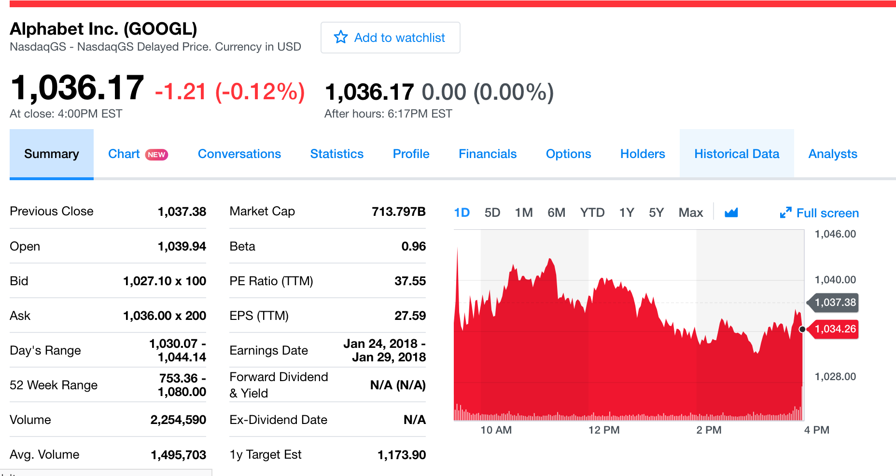
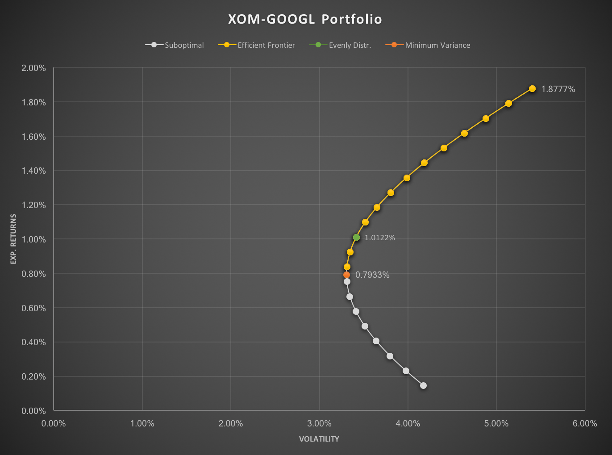
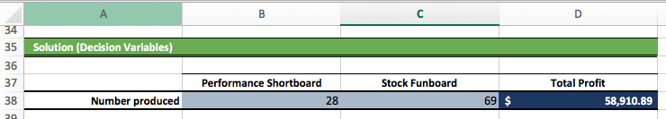
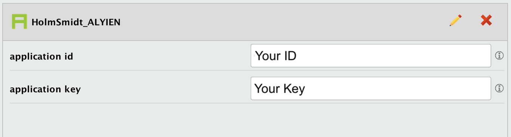
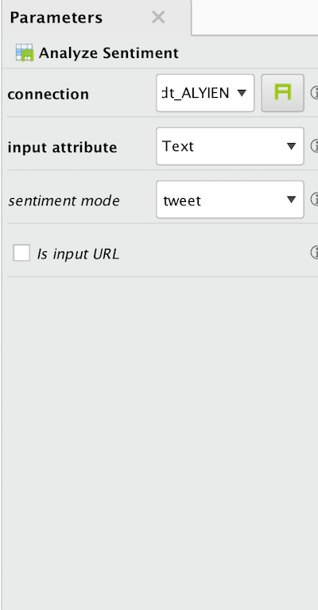
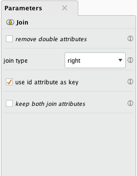
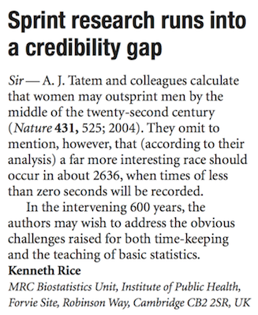
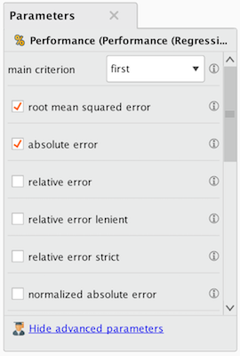
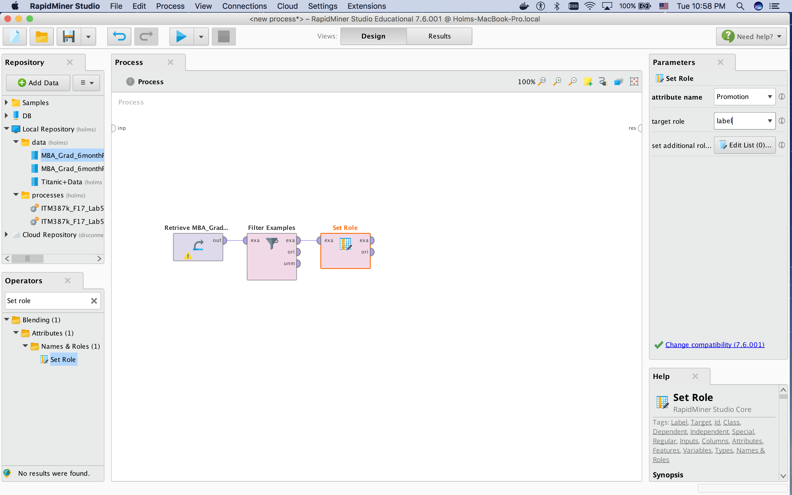

# ITM387K: Lab Manual

### URL: hlmes.github.io/itm387k

### Table of Contents

- General announcements
  - [Introduction](https://hlmes.github.io/itm387k/#introduction)
- Lab Assignments
  - [Lab 11: Portfolio Management](https://hlmes.github.io/itm387k/#lab-11-two-asset-portfolio-management) -- new
  - [Lab 10: Linear Programming Optimization](https://hlmes.github.io/itm387k/#lab-10-linear-programming-optimization-for-hic-surf) -- new
  - [Lab 9: Web Analytics with Google Analytics](https://hlmes.github.io/itm387k/#lab-9-web-analytics-with-google-analytics)
  - [Lab 8: Twitter Sentiment Analysis with RapidMiner](https://hlmes.github.io/itm387k/#lab-8-twitter-sentiment-analysis-with-rapidminer)
  - [Lab 7: K-Mean Clustering with RapidMiner](https://hlmes.github.io/itm387k/#lab-7-k-mean-clustering-with-rapidminer)
  - [Lab 6: Linear Regression with RapidMiner](https://hlmes.github.io/itm387k/#lab-6-linear-regression-with-rapidminer) --- Updated 11/22
  - [Lab 5: Decision Tree for predicting MBA graduates' promotion ](https://hlmes.github.io/itm387k/#lab-5-decision-tree-with-rapidminer)
  - [Lab 4: Power BI in Excel](https://hlmes.github.io/itm387k/#lab-4-power-bi-in-excel) --- Updated 10/3
  - [Lab 3b: Power BI - Part II](https://hlmes.github.io/itm387k/#lab-3b-power-bi---part-2) --- Updated 9/21
  - [Lab 3a: Power BI - Part I](https://hlmes.github.io/itm387k/#lab-3a-power-bi---part-1) --- Updated 9/19
  - [Lab 2: Tableau - Part II](https://hlmes.github.io/itm387k/#lab-2-tableau---part-2)
  - [Lab 1: Tableau - Part I](https://hlmes.github.io/itm387k/#lab-1-tableau---part-1) --- Updated 9/20
- BI Concepts
  - [BI Concept (11/17)](https://hlmes.github.io/itm387k/#bi-concept-of-the-week-1117)
  - [BI Concept (11/10)](https://hlmes.github.io/itm387k/#bi-concept-of-the-week-1110)
  - [BI Concept (10/27)](https://hlmes.github.io/itm387k/#bi-concept-of-the-week-1027)
  - [BI Concept (10/20)](https://hlmes.github.io/itm387k/#bi-concept-of-the-week-1020)
  - [BI Concept (10/13)](https://hlmes.github.io/itm387k/#bi-concept-of-the-week-1013)
  - [BI Concept (10/6)](https://hlmes.github.io/itm387k/#bi-concept-of-the-week-106)
  - [BI Concept (9/29)](https://hlmes.github.io/itm387k/#bi-concept-of-the-week-929)
  - [BI Concept (9/22)](https://hlmes.github.io/itm387k/#bi-concept-of-the-week-922)
  - [BI Concept (9/13)](https://hlmes.github.io/itm387k/#bi-concept-of-the-week-913)


# Lab 11: Two-Asset Portfolio Management

## Status

PAU

## Intro

In our last lab, we've looked at the utility of prescriptive analytics for profit optimization. We discovered that when combined, simple `Excel models` and the `Solver tool` can be very powerful in optimizing business objectives. In this activity, we want to see how prescriptive business analytics applies to finance applications such as portfolio management. More specifically, we'll be constructing two-asset portfolios using concepts from modern portfolio theory (MPT).

## Objective

In this lab, we want to learn about fundamental concepts of portfolio management through a hands-on two-asset portfolio construction in Excel. The objectives are to model portfolios in Excel, understand fundamental concepts of MPT, find the efficient frontier and minimum variance portfolio of a two-asset portfolio, and give a business presentation with investment recommendations.

## Task

You are working in the business analytics team of a small financial planning company and your task is to construct a diversified investment portfolio with two risky assets. You are expected to apply your knowledge of modern portfolio theory to find the efficient frontier and minimum variance portfolio of any two risky assets (your choice).

You will present your analysis and investment recommendations to your colleagues in the upcoming meeting. Your presentation should include

- your choice of assets;
- your analysis (minimum variance portfolio and efficient frontier);
- your investment recommendation (i.e. which weights would you choose);
- a well documented Excel model to share with your colleagues after the presentation.

**Notes**<br>
- Work in teams of 3-4 people of your choosing;
- Have fun with the assigment and explore your own interests;
- Use the provided sample files and replace `XOM` and `GOOGL` with different stocks of your choosing;
- Use 5-year historic data with a 1 month frequency from [Yahoo Finance](https://finance.yahoo.com);

**Presentation Tips**<br>
- Content:
  - **Why** should I (audience) invest in your portfolio?
  - **What** do you want me (audience) to take away from the presentation?
  - Your presentation should have just **one main idea**

- Format:
  - Make sure that graphs are readable (color, font-size, etc.)
  - Use little text on slides, all text font size 30pt or bigger
  - 5-8 min presentation (3-5 slides max)
  - 1-2 presenters

**Bottom Line**<br>
**Any robot can do the math of MPT, what value can you bring to the financial planning company as a human business analyst?**

## Data
- [Yahoo Finance](https://finance.yahoo.com)
- [Excel Model Blank](https://goo.gl/Rbxaue)
- [Excel Model In-Progress](https://goo.gl/iy84WM)
- [Class Worksheet](https://goo.gl/3V9D4n)

## Guidelines

### Data Retrieval and Import

**Data Retrieval**<br>

To retrieve data for an asset, you can download `5-year historic data` from [Yahoo Finance](https://finance.yahoo.com). Make sure to set the time to `5Y` and apply a `monthly filter` before downloading it. _The example below is for the `GOOGL` stock. You want to do this step on a different stock._<br>





**Getting Data Into Excel**<br>

To update the Excel model from the `XOM-GOOGL`, you want to replace data using copy and paste from the downloaded file to the provided template, rather than rebuilding the template.<br>
Open the csv file that you downloaded in the previous step and select the data from the `Adj Close` column (the highlighted column in the picture below). **Make sure to only select 60 datapoints and no header rows when copying it over.** Open the [Excel template](https://goo.gl/Rbxaue), go to the `data` sheet, and replace the data in column `B` or `C` with the new data. Make sure to rename the column headers to match the imported stock. <br>


**_You want to repeat the data retrieval and insertion for the second asset as well. Realistically, you may find yourself doing this over and over until you find two stocks that you like. (Parallelism comes in handy here.)_**

Make sure that the `Return` and `Excess Return` columns update properly. The following gives some equations for this sheet in case something went wrong on the import. Once you enter the formulae for cells `D4`, `E4`, `F4`, `G4`, you can drag them down for all 59 data rows. Formulae in cells `D63:D65` can be dragged to `E63:E65` to calculate the metrics for both assets.
``` javascript
D4: =LN(B4/B3)
E4: =LN(C4/C3)

D63: =AVERAGE(D4:D62)
D64: =STDEV.P(D4:D62)
D65: =POWER(D64,2)

F4: =D4-D$63
G4: =E4-E$63
```

### Modeling in Excel and Optimization

**Check data integrity**<br>
You want to make sure that the expected returns, volatility, and correlation for both assets updated correctly, as shown below. (You will have different values for different stocks, but you want to check that they match the values in the data sheet.) If not, try checking if their equations are correct. _Some of these formulae are array formulae, meaning that you need to press `COMMAND + SHIFT + ENTER` when you enter or update the equations. You can tell that they are array or matrix equations because they have `{}` in their equations when you click on either of the cells._

``` javascript
C5:C6 : =TRANSPOSE(Data!D63:E63)          # array equation referencing average
E5:E6: =TRANSPOSE(Data!D64:E64)           # array equation referencing standard deviation

F5: ='Var-Cov'!D20                        #  referencing correlation in var-cov sheet
```


**Generate sample portfolios**<br>
We can calculate expected portfolio returns and portfolio volatitility by varying the weights for each portfolio (cells `B16:D36`). To calculate the expected return (`F16`) and volatility (`E16`), we use the following equations and drag them down to row `36`. These are the equations from your [class worksheet](https://goo.gl/3V9D4n) that we also discussed on the board. Note that the absolute references, e.g. `$E$5`, are important so that you can drag the cells down over the entire range.

```javascript
E16: =SQRT(B16^2*$E$5^2+C16^2*$E$6^2+2*$F$5*B16*C16*$E$5*$E$6)
F16: =B16*$C$5+C16*$C$6
```


**Plot sample portfolio**<br>
This is a good time to plot return vs. volatility to get a better understanding of possible portfolios. Remember that any point on this rough chart is a possible combination of weights in your portfolio. The more data points you add in the previous steps (e.g. 1% steps instead of 5%), the more accurate this `scatter plot with smooth line and marker` will be. From the graph, we can have a pretty good understanding of an approximate range for the efficient frontier in terms of volatility and returns. In order to identify the minimum variance portfolio, i.e. the lower bound on the efficient frontier, we need to minimize the volatility. The `solver` tool in Excel can help us do this.


**Equally distributed and minimum variance portfolio**<br>
Before finding the MVP, we will do a quick calculation for an equally distributed portfolio (50-50). (The same equations for volatility and return are used here.) <br>


The solver tool can help us **minimize** volatility, **`E12`**, by varying the weights **`B12`** and **`C12`**. We must impose the constraint that the **weights add to 100%**. We also only consider positve weights here, i.e. we ignore borrowing portfolios. We want to use the `GRG Nonlinear` method here because we're dealing with a nonlinear system. This leaves us with the following solver parameters: <br>


If everything goes well, we'll receive the sucess message and view our final values for the variables cells: our portfolio weights. <br>


### Plotting the Efficient Frontier and MVP

Ultimately, we want to show the efficient frontier and minimum variance portfolio on a single graph. We typically don't care about suboptimal options, so we may leave those out of the graph completely, but I kept them in the graph just for clarification. Using different colors and data labels for some of the interesting portfolios such as the minimum variance portfolio and the evenly distributed portfolio is certainly helpful here.  <br>



# Lab 10: Linear Programming Optimization for HIC Surf

## Status

PAU

## Intro

Prescriptive analytics methods help us plan our strategies given a set of objectives, such as overall business performance. In some cases this can entail the forecasting (prediction) of web traffic to plan network infrastructures and server resources of an information system, in other cases, we may want to set our prices optimally to maximzie sales and profits. In this lab, we will look at optimimal resource allocation in manufacturing processes to maximize total profits. <br>

## Objective

In this lab, we will learn how to take a set of business objectives and constraints and represent them in an Excel model. Having the model representation in Excel, we will then learn how to apply linear programming optimization to maxmimize objectives given modeled constraints. The Solver tool will be used for the optimization process.

## Task

The holiday season is approaching and given the limited time and resources available, HIC wants to know how many of each of their two surfboard types (performance shortboard and funboard) they should shape to maximize their profits.

Given the specified inputs and constraints in the attached Excel Sheet and below, you are asked to model and optimize HIC's profits using linear programming optimization.

Use Excel's Solver tool (Simplex Linear Programming) for your analysis.

Please submit your Excel Sheet with your optimization model and the optimization output. Although part of the Excel file, also submit a screenshot of your auto-generated answer report.

## Data

[Excel Template with Constraints](https://goo.gl/DjEosv) <br>
[Class Worksheet](https://goo.gl/mk7QyZ)

## Constraints

-	HIC sells performance shortboards for $750 and funboards for $550.
-	Material Constraints:
  -	A shortboard blank requires 1.65 cu. ft. of Polyurethane (PU) foam
  -	A funboard blank requires 2 cu. ft. of  PU foam
  -	A total of 250 cu. ft. is available
-	Time Constraint:
  -	Surfboards are roughly manufactured in 4 steps: a) preparation of blank with stringer, b) shaping, c) laminating & coating, and d) sanding, polishing & finishing.
  - Each employee is specialized for one process. Time requirements for each board as well as total time availability per employee is provided in the table below:


  | | Process	Performance Shortboard [hours] |	Stock Funboard [hours] | Total Availability [hours] |
  |:---:|:---:|:---:|:---:|
  | Blank & Stringer	| 1	| 0.75 | 150 |
  | Shaping |	2.2	| 1.3	| 200 |
  |Lamination	| 1.8	| 1.3	| 140 |
  |Polishing	| 1	| 0.65 | 110 |

-	Inventory Constraint: In HIC’s inventory, the number of performance shortboards should be at least 40% of the number of funbaords.
 

## Guidelines

**Constraint Modeling** <br>
As done in class on a simplified version of this problem, the constraints need to be converted from verbal descriptions to mathematical equations (columns `F` and `H` in the image below) and represented in Excel (cell range `A5:D8` for the time constraints and `A12:D12` for the resource constraints). <br>


**Objectives** <br>

Similarly, the objectives can be modeled as shown below. `A22:B23` show the inventory constraint as well. <br>


**Decision Variables and Outcome**<br>

The decision variables are the variables that we want to vary such that the total profit is maximized. Cells `B38:C38` are being used for all calculations in the previously shown objectives. The `SUMPRODUCT()` is used extensively here since we have very nice and linear constraints. <br>



**Optimization**<br>

Using the `Solver` tool, we can perform linear programming optimization to find maximum profits. To do so, we specify the objective (cell and type of optimization), the variable cells (`B38:C38`) and then define each of our constraints. I prefer defining each constraint seperately as it will result in a more insightful answer report. The `Simplex LP` method is chosen here for optimization.
_Note: Performing the linear optimization without the integer constraint (check box under options) gives improved results._ <br>


**Results**<br>

Assuming that `Solver` found an optimal solution for us, we can analyze the answer report to better understand the optimal solution and its governing factors. Shown below is a sample answer report for this lab that solved the constraints without using the integer constraint. As shown, the inventory balance and the laminating process are the limiting (binding) constraints.<br>


_Note: If you perform the analysis with the integer constraint (by deselecting the checkbox under options in the solver window), you may end up with the following results. Note that although not labeled as `Binding`, it's still the PB Inventory Balance and the Lamination process time contraint that are limiting us here._<br>


# BI Concept of the week (11/17)

## Tableau Publishes BI Trends 2018

Tableau recently published their [2018 Top 10 BI Trends](https://goo.gl/s79Guk). While all of them are very interesting, we should pay attention to the importance of Liberal Arts (2) and Academics Investment (10). As discussed in class, the more thoughts/work you put into your BI motivation and the presentation of your analytics work, the more impactful it will be. Class activities allow you to hone your skills in this respect.


# Lab 9: Web Analytics with Google Analytics

## Status

PAU

## Intro

To conclude our series on Social/Web Analytics, we will look at Google Analytics (GA) for analyzing websites. The increasing number of published websites in recent years, certainly fueled by increased demand for online marketing and renewed trends in web development, motivates the question of what the purpose of a website really is. We then come to realize that we don't just develop websites because everyone else does so too, but because websites provide a platform that can help a business/organization strive to be more successful. But how can we measure the value of a website? How can we evaluate its performance? How can we use data-driven decisions in the design and maintenance?<br>

## Objective

In this lab, we will try to answer the aforementioned questions for the case of the current [HICSS conference website](http://hicss.hawaii.edu) using [Google Analytics](https://analytics.google.com). We will see how GA can be added to any website to start tracking user interactions, create dashboards and reports within GA, and how to analyze GA data using visual analytics platform such as Tableau or [Google Data Studio](https://datastudio.google.com). Applications of GA for website anlytics range from technical support (e.g. how to restructure/redesign/improve the website?) to providing marketing insights (e.g. what to advertise to whom to get people to the conference?), and can thus be very valuable. _Oftentimes people put GA on their site without ever analyzing its data. This lab will hopefully show you the value of GA, especially when paired with other platforms. (GA actually slows down your site a little bit due added javascript being loaded, so don't add it if you don't plan on using it.)_

## Task

**Part 1:**
For this lab assignment, please create a simple customer report or dashboard on Google analytics for the HICSS site (hicss.hawaii.edu) and export the file as pdf. Please attach a short narrative describing the objectives, i.e. BI Questions, that you're hoping to answer with this dashboard/report. (3 points)

**Part 2:**
For the second part, load Google Analytics data into Tableau (from within Tableau) or Google Data Studio and use your visual analytics skills to provide at least 1 recommendation to the HICSS conference organizers on how Tableau / Google Data Studio can be used in the future with Google Analytics to support one of the following:
- improved marketing efforts: e.g. # of visitors, cultural diversity, seasonal marketing, etc.
- better tracking of users: e.g. what's the interest like this year, how to improve visibility of low-performing tracks, mini tracks, work shops, etc.
- better user experience on the website: what to change to reduce bounce rates, longer sessions duration, higher conversion rates, what's causing pain for visitors (ease of use, loading times, etc.), and so on.

Submit a story that helps the conference organizers and technical coordinators understand what your recommended use of Tableau and Google Analytics is for future conference, and how you got to this recommendation based on your observations from current data. (7+2 points, 2 pts extra credit for extra efforts.)


**Notes**
- Part 2 requires your understanding of GA (Part 1)
- The documentation for GA is excellent, make use of it.
- **_You may use Google Data Studio instead of Tableau to make the data import easier_**.
- [Tutorial 1](https://goo.gl/ECmML6) and [Tutorial 2](https://goo.gl/Yca28J) show how to avoid sampling limitations when importing data to Tableau.

## Guidelines

The following provides sample illustrations of a tracking tool that can be used during the paper submission period to monitor interest in the various tracks. Both GA and Tableau data are filtered for visitors that actually go to the track description pages.

**GA Dashboard** <br><br>


**[Tableau Dashboard](https://goo.gl/2CxcrL)** <br><br>


**Planned Paper Presentations (HICSS-51)** <br>
Looking at the upcoming presentation numbers, it is interesting to note that these correlate with the traffic analysis for this year's paper submission period. _Note however that this conclusion based on this data alone is biased because the tracks with more paper presentations also offer more minitracks, where each track is limited to about 2-6 papers. Further traffic analysis would be needed to see if the audience is aware of this beforehand._ <br><br>


# BI Concept of the week (11/10)

## Web Mining with Python

In Lab 8, we've already seen the application of web mining for BI purposes through the use of the Twitter API for data acquisiton. Social media networks are however not the only mediums available to you to scrape data from, in fact, it's only a small (but rapidly growing) portion. This [web scraping with Python tutorial](https://goo.gl/pCF51R) gives a great introduction to _BeautifulSoup_, an easy-to-use Python library that helps you retrieve data from any website. (Almost any, I think it doesn't work well on Javascript generated content, which is unfortunate as more and more content on websites is generated with JS.) <br>
It only requires a little understanding of `html` documents to use this library, so I've provided you with a a few sample applications that you can play with and see how it can be modified to retrieve data that you are interested in.
* [This file retrieves surf conditions from surfline.com and weather data from weather.com.](python/webScraping/scrape_weather_surf.py) Similar scripts can be useful in app developement or ETL scripting for data warehouses. For example, in addition to just recording sales transactions of a North Shore food truck, you could also store weather and surf data to  correlate this information in a later analysis.
* [This file retrieves Yelp reviews from specified pages and stores them into an Excel file.](python/webScraping/yelpReviewScraping.py) Next steps would include the automation of searching for restaurants, grabbing the search results, and then retrieving 100+ reviews for later sentiment analysis.


# Lab 8: Twitter Sentiment Analysis with RapidMiner

## Status

Pau

## Intro

As consumers, we understand the power of opinions: opionions about products, opinions about companies, opinions about politicians, etc. As business analysts, we can use opinions to our advantage to either analyze the status quo (e.g. how did people respond to the latest product or media release?) or to make predictions (e.g. who will win the election?). In BI terms, this is referred to as **Sentiment Analysis**. In this lab, we will explore sentiment analysis for crowdsourced data (Twitter data).

## Objective

The objective of this lab is to use a sentiment analysis tool in RapidMiner to analyze (or predict) a topic of your own personal interest. We will use Twitter data as our data source and the AYLIEN text analysis tool for sentiment analysis. Whether it's the latest tech item you want, or sports team, company, celebrity, politician, news story or ongoing topic that interests you, you are free to define your BI objectives (defined by a set of BI questions) and seek answers with tools shown in class.


## Task

This assignment requires you to use RapidMiner extensions for Data Mining (Twitter) and Sentiment Analysis (Text Analysis by AYLIEN). You need to have a twitter account as well as an AYLIEN API key (sign up [here](https://developer.aylien.com/) - up to 1,000 calls per day free). We learned in class (a) how to download twitter data for a specific query, (b) clean the data, (c) run a sentiment analysis, (d) aggregate the results, and finally (e) summarize data using the Chart tab.

To complete this assignment, you need to submit your final charts containing the count for polarity and subjectivity of the downloaded tweets and a short explanation of the subject of your analysis and your results. Make sure to clearly state your BI objectives and outcomes.

**Notes**
- You may choose a topic of your own interests.
- Your final twitter query should have at least 500 tweets (or close to it).
- Since you are limited by 1000 calls per day, make sure to test your process with less tweets.
- I'd recommend testing with as little as 10 tweets and then scale it to 500+ when you have all parameters finalized.
- Using breakpoints after your Twitter query and data processing is also recommended.

## Guidelines

Your minimal overall process should look as follows, containing your Twitter query, attribute selection, and text analysis block. <br>


### Twitter API and data mining
In order for us to use the Twitter node, we need to configure a connection first. Under the node parameter, either select an exisiting connection or create a new connection by clicking on the button with the Twitter icon. You will need an exisiting twitter account and should simply follow the guided steps in the authentication instructions. Once completed, you should have your RapidMiner-Twitter connection ready to go: </br>


Depending on your BI objective, you can either use the `Search Twitter` node or the `Get Twitter User Statuses` node. If you go with the `Search Twitter` block for example, you would want to configure your query for your topic of interest and restrict the language to English tweets as shown below:


You can use the `-http -https -RT` notation in your query to filter tweets that contain links (`http` or `https`) or are labeled as re-tweets (`RT`).

The output of your twitter search is similar to what's shown below. You can choose to only filter the attribute of interests for your analysis view in the end.


### AYLIEN API and sentiment analysis
As aforementioned, you need to create an API key for the AYLIEN text analysis block [here](https://developer.aylien.com/). Then you also need to install the AYLIEN text analysis plugin in RapidMiner: <br>


Once installed and added to the process, you can add your key to RapidMiner by creating a new connection from the text analysis parameter settings.



In your node parameter configuration, set the analysis attribute to `Text` (this is the default column name of your tweet contents), and set the sentiment mode to `tweet` as there are different algorithms depending on the length of the text that you're analyzing.



_**Note:** RapidMiner will send each tweet to the AYLIEN server, where their algorithms determine the polarity and susbjectiviy for each tweet and return the subjectivity, polarity, and respective confidences. Each tweet is counted as 1 call and you are limited to 60 calls per minute and 1000 per day._

### Process

Adding breakpoints to your nodes, e.g. your `Search Twitter` node, can help to review search results before sending them over to AYLIEN for analysis. You can do so by right-clicking on your node, and selecting the `Add Breakpoint After` option. When  you run your process with breakpoints, it will stop at each breakpoint and show you the output of that node as a result. You can either select to resume your process to finish the analysis or stop the process if you want to make modifications.

### Results

In your results tab, you want to look at the data, statistics, and charts during your analysis. The data tab can show you the classifications and confidences for each tweet, which will help you understand the efficacy of the sentiment analysis on an individual level and what type of problems the algorithms may or may not have.


The statistics view is interesting because it shows use the histograms for classifications and confidences. As shown below, for this example, the subjectivity could be determined with high confidence, wheras the polarity was often predicted with very low confidence. This information is important for the evaluation of the validity of the results. In other words, you want to ask yourself if you can trust the results? Are parts of the analysis stronger than others?


Lastly, we can visualize our results using pie or stack column charts. Make sure to select the right attributes for your chart parameters; that is, group your columns by subjectivity or polarity and stack your columns by polarity or subjectivity. The aggregation should be set to `count`.


In your analysis, focus on the **objectives (BI questions)** of your analysis and how your **analysis answered these questions**. It is not uncommon to not be able to come up with a conclusive answer based on a single sentiment analysis for one data source, but it should at least show you some **trends** and guide you in finding conclusive answers to your questions. If you discover situations (tweets) where the sentiment analysis fails, make sure to discuss them as well.

# BI Concept of the week (10/27)

## Creating a Dual Axis Horizontal Bar Chart with Tableau

Here's a quick tutorial on Tableau. Give it a try and refresh your Tableau skills.

Imagine you have two metrics and want to compare these in a single viz side-by-side. You've chosen to use a horzizontal bar chart and now want to compare the two metrics within each category. The following will walk you through a few simple steps to achieve this.

Let's start with a horizontal bar chart with one metric (column) and one dimension (row). Then we drop our second metric pill into the column shelf. <br><br>


By default, these will be split into two separate axes. In order to compare these two metrics within each category, we can add `Measure` names as our second pill in the rows shelf and apply a dual axis. Then we go on over the formatting card for `All` and change the viz from `Circle` to `Bar`.


This looks a lot better, we can now easily compare the two metrics within each category. Final formatting can be applied at this point, such as coloring and sorting. The `pivot` operator could be applied to obtain a vertical bar chart with direct metric comparison.

# Lab 7: K-Mean Clustering with Rapidminer

## Status

PAU

## Intro

Oftentimes, we want to find patterns in customer and business data to identify customer and market segments that we can target in our sales and marketing efforts. The difficulty with this is that the underlying characteristics of each segment are unknown; that is, one may wonder which variables can help in the differentatiation of customer groups. Unsupervised learning algorithms, such as clustering algorithms, can help us with this. More specifically, we will look at using K-Means clustering to identify market segments using customer survey data. Similar methods also apply to many applications outside of the realm of business applications.

## Objective

The objective is to use the K-Mean clustering method to identify k distinct customer segments for our organization. We will use customers perception data of either the Honolulu Coffee Company or Hawaiian Airlines dataset to do so. Customer segments should then be visually displayed for the marketing department using Tableau.

## Task

In this group lab, you have the choice between the two aforementioned data sets. Both data sets contain customer perception data that you need to use and select in your clustering analysis. Your task is thus to **build a predictive model in RapidMiner** using the selected dataset and the K-Mean cluster method and select the attributes and cluster numbers for your segmentation analysis. Your understanding of the modeled domain and performance metrics will help you identify appropriate clusters, which you can then rename with descriptive titles (e.g. novelty seeker, experimenter, comfortable flyers, flight searchers, explorer, oldies, richies, etc.).
Once identified, please **visualize your clusters in Tableau** with the new descriptive titles as aliases. Make sure that you're getting your point across in Tableau of what characterizes each clusters. You are free to choose any type of visualization and presentation format (single viz, dashboard, or story) of your liking.
Please share your findings in a group report following the same format from the first report. Write your report as if it was to be read by the marketing department of your organization, so please ensure that your data-driven, actionable insights are presented clearly and convincingly!

**Notes**
Please ask yourself the following questions when working on this assignment, especially when writing the report.
- Who is your audience?
- What do they care about?
- How does your analysis help them? Does your analysis provide actionable insights?
- What is the bias to your model? What are the model's limitations?
- For this assignment, each student should submit the group report with RapidMiner screenshots and Tableau links in the Appendix.
- If looking at the Tableau graphics online provides no added value–i.e. there are no interactive features, no story, etc.–then please integrate the visualizations into the report directly.


## Dataset
[Honolulu Coffee Company](https://goo.gl/Xxp3ty) <br>
[Hawaiian Airlines](https://goo.gl/yBSaK3)


## Guidelines

### Process Modeling

1. The process modeling procedures are very similar to our previous labs.<br>

  
2. Prior to configuring your clustering block, you want to select the attributes that you'd like to use for the clustering algorithm. This step demands basic  understanding of the domain (e.g. coffee shop sales, airlines) as well as iterative testing. The selection of attributes will be the bias of your clustering algorithm, so make sure to put some thought into it. (The selection shown in the image below was just for demonstrative purposes.)<br>

  
3. The kmean, and data do similarity parameters are shown in the following images.
  - We set the number of clusters, k, to the number of segments that we suspect to best represent our domain. We select the squared euclidean distance as our similarity measure. <br>
  

  - The data to similarity block can just be set to the same distance measure as selected for the clustering algorithm above. (If not visible due overcompression in the image below, please select the BregmanDivergence and SquaredEuclideanDistance in the selection fields below.) <br>
  
3. In order to visualize our results in Tableau, we need to write them to an Excel, or similar, file. Before doing so, it'd be nice to have our data back in it's non-normalized form. To do so, we simply concatenate the original attributes with the normalized attributes used for clustering. This works well with the `join` operator because we did not change the order of our input data. We just need to make sure that the we do not remove duplicate attributes, as shown below: <br>
  

### Results Evaluation
During the process modeling and tweaking of our governing parameters, i.e. number of clusters and attribute selection, we can use RapidMiners Results views to evaluate the model adequacy.
1. We can look at the model overview to get a general idea of the clustering. <br>
  
2. A further look at the cluster plot or centroid table shows the differences between the clusters. A nicer version of this in Tableau may be a good start for visualizations as well. <br>
  
3. The cluster density performance analysis can help decide which attributes provide "denser" segments. Comparing cluster densities with varying number of clusters, e.g. k = 1, 2, 3, 4, 5, etc., can be misleading as a higher number of clusters will naturally give higher densities in smaller clusters. It is thus important to understand the domain and select a reasonable number of clusters that can also help the marketing department in their efforts. <br>
  

# BI Concept of the week (10/20)

## Overfitting predictive models

Training predictive models for the "best fit" for a limited set of historical training data gives rise to the problem of overfitting, which means that the model fits the training data very (or too) well but does not generalize well to yet unseen data. Overfitting can happen in various forms depending on the applied machine learning algorithms (e.g. linear regression, polynomial regression, K-Mean clustering, Decision Tree classification, etc.). One thing to be cautious of with linear regressions is the generalization of the model to range of values in the feature space that is far away from the value range of the training data's features.
For example, if you train a model for a certain time range (e.g. past 10 years of the company's sales from  2007-2017), your model will not generalize well for predicting sales for 2117. <br><br>

The following example (from [Dr. Susanne Still's](http://www2.hawaii.edu/~sstill/index.html) machine learning class) helps me remember this idea: <br>





# Lab 6: Linear Regression with RapidMiner

## Status

PAU

## Intro

After having looked a binomial (binary) classification in predicitve analytics, we will now look at regression models that allow us to predict continuous outcomes (e.g. sales, profits, housing prices, etc.). Specifically, we will work one applying the linear regression model, a rather simple, yet oftentimes powerful tool. To goal of linear regression is to describe the relationship between one or more variables. For example, how do the number of bedrooms and house size relate do the market value of the house?

## Objective

The objective is develop/train a linear regression model that can describe the relationship between potential food truck profits and its location (the number of people living in the area) as well as the relationship between the number of bedrooms, house size, and the market value of the house. We will then see how we can use the model for predictions.

## Task

In this lab, we will investigate two scenarios, one for univariate linear regression and one for multivariate linear regression. We will learn how to process data, develop a predictive linear regression model, and test and validate our model in RapidMiner Studio.

**Scenario A: Let's Start a Food Truck**<br>
You want to open a new food truck but are undetermined where to do so. You've found a data set (from [Dr. Ng's machine learning class on Coursera](https://www.coursera.org/learn/machine-learning)) correlating profits of existing food trucks with the number of people living in the town/city where the food truck is located. Now you want to apply your knowledge of linear regression to create a predicate model that can tell you potential profits given any town with some population.
The file FoodTruck_Data.txt contains the dataset for this predictive analytics problem.

Use your model to predict the market value for a city that you like with 70,000 people in it.


**Scenario B: Let's Sell our House**<br>
Imagine you want to sell your house and want to figure out what a good market price would be. You want to apply what you've learned about predictive modeling to solve this problem. You have collected recent information of recent houses sold (house size, number of bedrooms, and housing price), and now need to apply linear regression with multiple variables to predict a suitable sales price for your house. The file HonoluluHousingPrices.txt contains the dataset for this problem.

Use your model to predict the market value of a 3 bedroom apartment with a size of 3000 sq. ft.

**Notes**
- Remember that using multiple variables (features) requires normalizing (Z-transformation) of each variable before training the model.
- For each scenario, evaluate the performance of your linear regression (root mean square and absolute error) on an unseen test data set. How "predictive" are your models?
- For this assignment, submit a screenshot of your process, the results (model and errors), a plot of the test data and model (using RapidMiner, Excel or Python), and your two predictions.
- You need to upload 2x4 files. Please rename them as
  - ITM387K_F17_Lab6A_LnameFinitial_Process_V1.0 and
  - ITM387K_F17_Lab6A_LnameFinitial_LinRegModel_V1.0 and
  - ITM387K_F17_Lab6A_LnameFinitial_Performance_V1.0 and
  - ITM387K_F17_Lab6A_LnameFinital_Graph_V1.0
  - ITM387K_F17_Lab6B_LnameFinitial_Process_V1.0 and
  - ITM387K_F17_Lab6B_LnameFinitial_LinRegModel_V1.0 and
  - ITM387K_F17_Lab6B_LnameFinitial_Performance_V1.0 and
  - ITM387K_F17_Lab6B_LnameFinital_Graph_V1.0


## Dataset
[Food Truck](https://goo.gl/GjwLuu) <br>
[Housing Prices](https://goo.gl/ghgvAX)


## Guidelines

### Process Modeling

1. The process modeling procedures are very similar to lab 5. You should end up with the following process for Scenario B (and similar for Scenario A).<br>
  

2. The model parameters and node configuration are shown in the following images.
  - After retrieving the data, we set the role of the sales price as our label. (Remember from class that in supervised learning, the label is what we are trying to predict. )<br>
  

  - When training multivariate linear regression models (models with more than one feature), we need to normalize our features to remove any bias from features. If we didn't do this, the model would naturally consider apartment size (about 2000-4000 sq.ft.) to be more significant than the number of bedrooms (around 0-5 bedrooms). The image below shows how to apply the Z-score normalization for a subset of features. (I prefer to not normalize my label.)<br>
  

  - Once normalized, we can split the data into training and test data (between 60/40 and 80/20).<br>
  

  - Having the training data, we will train our linear regression model. Make sure to set the polynomial degree to `1` and adjust your coefficient limits (`-/+ 1.0E8` seems like a good option here due to normalized features and large housing prices).<br>
  

  - We will apply the learned regression line to the test data and evaluate the performance (use pregression performance here) using the root mean squared error and the absolute error.<br><br>
  

  - Connect the performance, model, test examples and training examples to out outputs and run the simulation. (If you want to visualize data outside of RapidMiner, e.g. Excel, Tableau, Python, etc., you can `Write to CSV` or `Write to Excel`.)<br>
  


### Results Evaluation

The following images show the results for our training and performance testing. The regression line's equation can be described as <br>

 <br><br>
The root mean square error and absolute error on the test data are <br>

 <br><br>
These errors were calculated based on these test data predictions:<br>

 <br><br>
Plot the test data (labels and predictions) to visually display how good the model is: <br>


### Making Predictions

Imagine you want to predict the housing price for a 3 bedroom / 3000 sq.ft. apartement using the results from B. In order to use the model, the regression line equation, we need to remember, that z-score features were used to train the model. This means that we need to convert our input to z-scores before we can plug them into our equations. The formulae for our z-scores were
```
Bedroom: z-score = (#bedrooms - average) / (stand. deviation)
Size: z-score = (size - average) / (stand. deviation)
```
If we look at the data statistics in RapidMiner for the entire dataset (**make sure it's the entire data set, not just the training or test data set!**), we can simply retrieve the averages and standard deviations that we need here.
```
bedroom: average = 3.17 , stand. deviation = 0.761
size: average = 2000, stand. deviation = 795
```

<br><br>
Thus, our 3br/3000sq.ft input can be expressed as
```
Bedroom: z-score_bedroom = (3 - 3.17) / 0.761 = -0.223
Size: z-score_size = (3000 - 2000) / 795 = 1.26
```
Now we can plug these numbers into our polynomal regression model from the results to make our prediction.
```
housing price
= 111921 * z-score_size - 4056 * z-score_bedrooms + 338712
= 111921 * 1.26 - 4056 * -0.223 + 338712
= 480,600
```
**Thus, we can predict a housing price of about $0.5M for a 3 bedroom and 3000 sq.ft apartment.**

### Scenario A: Results

Although scenario A was not discussed in the guidelines, the following shows results for your reference. Again, your model may be slightly different due to the randomized data split.

The following images show the results for our training and performance testing. The regression line's equation can be described as <br>
 <br><br>
The root mean square error and absolute error on the test data are <br>
 <br><br>
Plot of the test data (labels and predictions) to visually display how good the model is: <br>


# BI Concept of the week (10/13)

## Confusion matrix: precision vs. recall

Confusion matrices are commonly used to evaluate the performance of binomial (yes/no) classification models. The confusion matrix is typically a 3x3 matrix with column and row labels, which turns it into a 4x4 table. The first four values show the number of true positives, false positives, false negatives, and true negatives after applying your model on a test data set. (Adding up these four fields tells you how many predictions were made, or in other words, how many data points there are in a test set.) <br>
The right-most column informs on the precision of the predictive model (one value for yes-predictions, one for no-predictions). The bottom-most row informs on the class recall of the predictive model (one value for the yes-recall rate, and one for no-recall rate). The calculations for the precision are `Yes-Precision = TP/(TP+FP)` and `No-Precision =  TN / (FN + TN)`. Similarly, the recall rates can be calculated as `Yes-Recall = TP / (TP + FN)` and `No-Recall = TN / (FP + TN)`. Putting all this together, we obtain a matrix such as shown below.


We can think of precision and recall also using the following questions:
* _If the prediction is yes, how like is the prediction to be true? (If precision is high, we can trust the prediction.)_
* _Of all the "yes" events that occurred in the test data, how many did we predict to occur? What's our chance of "catching" an occurring "yes" event. (If recall is high, it means that we caught most of them if not all.)_


**Consider the following examples for clarification.**

Difference of class recall and precision when evaluating a (terror) attack prediction model. <br> Assume that "yes" means that an attack happened or will happen. It follows that "no" means that an attack did not happen or will not happen. <br>
In this case the "yes"- recall describes how good your predictive model performed in predicting attacks that actually did happen. In other words, of all the attacks that happened, how many could we predict correctly? A 100% recall rate means that your prediction was correct for every attack that did occur. You could call this the _"better safe than sorry"_ classifier; you would want this classifier for this situation.  <br>
"Yes"- precision describes how much we can trust the model's prediction when it says that an attack is going to happen. In other words, out of all the predictions where we predicted yes, how many did actually happen?

Difference of class recall and precision when evaluation a predictive model for cafe recommendations. <br> Imagine that you give each customer in a cafe a questionnaire during their visit that asks them to rate the cafe's look, ambience, service, quality of drinks/food, and whether they would recommend the cafe to their friend. (yes = "I would recommend this cafe", no = "No, I wouldn't recommend this cafe.") <br> Now you've come up with a predictive model than can predict whether or not someone would recommend this cafe based on their opinion on look, ambience, service, and drink/food quality. <br>
A high "yes" - recall means that the model performed well in catching (correctly predicting) when a customer actually did recommend the cafe. Whereas a high precision means that if you predict that a customer recommends the cafe, chances are high that they actually will recommend the cafe.

## F<sub>1</sub> - Score

The F<sub>1</sub>-score is a metric that we can use to evaluate performance based on precision and recall together. It is the harmonic mean of precision and recall and thus defined as `F1-score = 2 * recall * precision / (precision + recall)`.

# BI Concept of the week (10/6)

## Accuracy vs. Precision

Sometimes it can be easy to mistake one for the other, but it's important to understand the meaning of each and differences between the two when evaluation predictive models. The illustration from  [this website](https://goo.gl/XMAZMv), shown below, illustrates the idea very well.


The following definitions come also from [here](https://goo.gl/XMAZMv). Sometimes it's easy to forget the definitions, so it's good to review them now and then.

- **Precision:**
	The quality of being reproducible in amount or performance
- **Accuracy:**
  The quality of being near to the true or desired value
- **Mean:**
  The average . Equation: Add the values and divide by the number of values. Of the set of values 2, 6, and 7, the sum is 15. There are 3 values, therefore 15 ÷ 3 = 5; the mean is 5.
- **Median:**
  The middle value in an ordered set of values.
  Of the set of values 2, 6, and 7, the median is 6.
- **Mode:**
  The most frequent value in a set of values.
Of the set of values 2, 6, and 7, there is no mode. Of the set of values 2, 6, 7, and 6, the mode is 6.
- **Range:**
  The change or difference between extremes in a set of values.

# Lab 5: Decision Tree with RapidMiner

## Status

PAU

## Intro

Our next analytics series is on predictive analytics. In predictive analytics, the goal is to build a predictive model that can forecast a behavioral outcome given certain inputs to a system.

Analogously to developing scientific models, such as Hooke's Law for springs where a spring's restoring force can be calculated in advance (predicted) based on the spring model (its stiffness) and the model input (its displacement), predictive models need to be learned from test data, and its performance evaluated by testing the model's predictive capabilities on new data (test data).

In this first lab of our predictive analytics series, we will look at building a decision tree predictive model in Rapidminer and learn and test it using an MBA graduates' promotion data set.


## Objective

The objective is develop/train a decision tree model that can predict if an MBA student will receive a promotion after graduation, and to evaluate the efficacy of the model using a confusion matrix evaluated on an unlearned test set.

## Task

In this lab, we will learn how to process data, develop a simple predictive model (decision tree), and test and validate our model in RapidMiner Studio using the dataset attached.

For this lab assignment, please create and submit: one decision tree with a training/test data validation results (confusion matrix) for the likelihood of getting a promotion as a MBA graduates in six months after the program completion. Append a short description of what the decision tree and confusion matrix tell you.

Note: You need to upload three files. Please rename them as ITM387K_F17_Lab5_Name_DecisionTree_V1.0 and ITM387K_F17_Lab5_Name_ConfusionMatrix_V1.0 and
ITM387K_F17_Lab5_Name_Results_V1.0


## Dataset
[MBA Promotion Dataset](https://goo.gl/MJ2eHs).


## Guidelines

### Process Modeling

1. Data retrieval and cleaning.
  - We first insert data from our local filesystem.
    

  - Then we can apply a filter that removes all records where the promotion column (attribute) is missing.
    

  - In order to train a predictive model using supervised learning, we need to define a label that determines what it is that we're trying to predict. In this case, it is the promotion status that we want to predict.
    

  - The following shows a summary of the data retrieval and cleaning process.
    

2. Summarize the first step into a subprocess
  - Sometimes, it can be nice to summarize multiple blocks into subprocesses. We can do this here by selecting what we have so far for data retrieval and modeling and creating a subprocess.
    

  - It's important to make sure that our examples are piped to the output of the subprocess. Otherwise nothing will be returned by the subprocess. (I like to think of this as functions in coding. You can write functions for a set of operations and then just define what to return.)
    

3. Split data for training and testing.
  - A good split for training/testing data is about 70-30. The automatic splitting mode will randomize/shuffle the data before splitting. Rarely would you want to use a linear split. (This is important to know if you wanted to do this in R or Python.)
    

4. Train your model and evaluate the performance by applying the model to test data
    - We can use the decision tree model in this example and train it with the training data. Then we apply the learned model to the yet unseen testing data, and evaluate the model's predictive performance. 

5. Run the process
  - Once you have all your blocks together and connected all your results outputs, you can run the process.
    


### Results Evaluation

The following show some of the result of a sample run. It is your job as an anylists to interpret the meaning of the outcome and determine the model's usefulness.


# BI Concept of the week (9/29)

## Cross-Disciplinary Collaboration

Looking at the [2017 Business Trends](https://bi-survey.com/top-business-intelligence-trends-2017), we notice an increased importance in BI collaboration, for a good reason. As you have noticed during your Lab 3b, topic specific analyses can become difficult if one isn't yet familiar with operation procedures, objectives, goals, etc. of the topic of your analysis. At other times, you may be very familiar with the topic and know excactly which KPI's to compute, but aren't quite sure how to compute them. Although I'm sure each of you can learn all of the above, often you simply don't have the time.

Both cases illustrate the beauty of cross-disciplinary collaboration in visual analytics. People with various skills and backgrounds (e.g. marketing, sales, management, engineering, IT, statistics, etc.) will observe different aspects in identical vizzes. Combining your resources and performing the Visual BI analysis collaboratively can thus be a powerful approach to creating impactful BI analytics results.

Don't be shy and **seek collaboration** with peers from different fields and backgrounds!

<iframe width="800" height="600" src="https://bi-survey.com/d3/test/trendtimeresp.html" frameborder="0" allowFullScreen="true"></iframe>


# Lab 4: Power BI in Excel

## Status

PAU

## Intro

Power BI for Office 365 provides a self-service BI platform within the Excel environment that you're already familiar with.

For this lab, we will load the Coffee-Chain dataset (linked below) into Excel using Power Query. We will also use Power Query to create new tables. Then, we use Power Pivot to create a data model, summarize data, and define new measures and KPIs. With help of Power Map and Power View, we will finally visualize the KPIs.


## Objective

Design a KPI dashboard and 3D Map Video using Power BI in Excel.

## Task

For this assignment, first, you need to upload a 3D Map video (5%). Your video should visualize at least one Coffee Chain's KPI (e.g. Sales, Profit...) by location and product category over time. Also, you need to upload your PowerView KPI dashboard monitoring sales KPIs (5%).

Note: You need to upload two files (video and Excel file). Please rename them as ITM387K_F17_Lab4a_[Name]_V1.0 and ITM387K_F17_Lab4b_[Name]_V1.0

## Dataset
Same as in Lab3a: [Coffee-Chain dataset](https://goo.gl/HQbUXr).


## Guidelines

### Process design

#### 1. Data Query and Transformation

Very similar to our previous visual analytics processes, we first need to access our data set and then model it.
Querying data with PowerQuery is very similar to previous methods that we've seen so far, we need to select data to import, edit attributes (name, data types, etc.), merge attributes, or remove attributes, and then execute the query. The following pictures indicate some of the necessary steps.

- Selecting the `From Table` option allows us to query exisiting tables in our Excel sheet. (Queries to external databases would be possible here too.)


- If not selected by default, we need to select the correct data range for the query. Make sure to not get any extra empty columns or empty rows. (Could lead to error messages when building relationships later due to _nil_ record duplicates. )


- Apply some modifications to your attribute names, merge attributes, or even remove attributes if they seem faulty or unnecessary.


- As with PowerBI Desktop, select `Close & Load` to execute your query.


- Repeat the previous steps for each of the relations that you'd like to include in your analysis (e.g. your Sales, Location, and Product relations).

#### 2. PowerPivot
Once we have queried our data, we are ready to build our data model. Remember that a data model can be as simple as a single relation (table) with multiple attributes (columns) and records (rows), or much more complex with multiple relations and relationships between them.

- As a first step, find the PowerPivot tab, and add your imported tables to your model. Note that you will have to add each of the relations that you've queried separately.


- Once you have the relations added to PowerPivot, we can start adding relationships. Remember that relationships connect common attributes that are shared between multiple relations. Unlike other tools that we've seen so far, PowerPivot can only form 1:M relationship.


- Defining custom measures is an important part of any visual analytics report as it will allow you to track important KPIs quickly. In PowerPivot, we can use the fields below the records to create calculated measures using the DAX language that we've already seen in PowerBI Desktop. A (very) brief selection of commands is provided in the [following section](#creating-measures-for-sales-relation).


- Defining KPI's based on the calculated fields can be an effective method of tracking current performance, desired performance, and the thus resulting performance status. Defining KPI's in PowerPivot can be achieved by selecting the measure that you want to track, defining the target value, and then selecting the number ranges for the various statuses. (See image below.) The target values typically depend on your organization.


#### 3. PowerView

PowerView allows us to create our executive dashboards within Excel. If you cannot find PowerView in your Excel Toolbar Ribbon, you will need to customize your Ribbon using [these instructions](https://goo.gl/YXCH52).

Building the view is mostly like PowerBI Desktop. You can select the fields of interest on the right, add filters, and then style your graphs using the `DESIGN` and `LAYOUT` tabs.

Below is a sample outcome with KPIs added to the top section.

  


#### 4. 3D Maps

3D Maps is an interesting tool to create geo-location based visualization. The objective is to create a video that visualizes the development of your measures over time and by region.
The 3D Map tool can be access from the `Insert` tab.
To create you video, you will need to create multiple sections, each with one or more Layers. You have controls over Layer titles, duration of each slide for the video, etc. See the image below for getting started and the video for seeing a simplified version of your output. Make sure to ultimately export your video as a mp4 data file and to post it on google classroom as part of your submission.


<video src="images/3DMap_Video_v3.mp4" width="640" height="400" controls preload></video>


### Creating measures for sales relation

- Profit Ratio
  ```c
  Profit Ratio := SUM([Profit])/SUM([Sales])
  ```
- Marketing Ratio
  ```c
  Marketing Ratio := SUM([Marketing Expesnes])/SUM([Sales])
  ```
- Sales Mark Up
  ```c
  Sales Mark Up := SUM([Sales])/SUM([Cost of Goods Sold (COGS)]) - 1
  ```
- Previous Month Sales
  ```c
  PMSales := CALCULATE(SUM([Sales]), PREVIOUSMONTH('Caldendar'[Date]))
  ```
- Month-to-Month Sales Growth. (We need an if-statement to check that [PMSales] exists, otherwise we'll end up with `0` in the denominator. )
  ```c
  Sales Growth := IF([PMSales]=0, 0, (SUM([Sales])-[PMSales]) / [PMSales])

  ```


# BI Concept of the week (9/22)

## Exploration vs. Exploitation

The concept of **Exploration vs. Exploitation** is commonly found in reinforcement learning (machine learning discipline) and evolutionary computation. As stated in [this paper by Melani Coggan](http://ftp.bstu.by/ai/To-dom/My_research/Papers-2.1-done/RL/0/FinalReport.pdf), "finding a **balance** between exploration (attempting to discover new features about the world by a selecting sub-optimal action) and exploitation (using what we already know about the world to get the best results we know of)" is a common problem.

The problem of exploring and exploiting unknown landscapes is not only applicable to learning agents and evolutionary systems, but really **anytime that you're trying out something new**. Put nicely by [Tom Staffor in his Blog](http://www.tomstafford.staff.shef.ac.uk/?p=48), "the exploration-exploitation trade-off is a **fundamental dilemma** whenever you learn about the world by trying things out. The dilemma is between **choosing** what you know and getting something close to what you expect (**‘exploitation’**) and choosing something you aren’t sure about and possibly learning more (**‘exploration’**)".

_So how does it relate to BI/BA and what we're doing in class?_
As an analyst, you are exploring new datasets in hopes of learning or discovering what is going on in the organization (i.e. descriptive analytics), why something is going on (i.e. diagnostic analytics), and how it can be changed (i.e. prescriptive analytics). Given the limited time and resources that you have for each analytics task, you need to allocate your resources effectively, which means that you will have to find the right balance between **exploration and exploitation**.

This [article by Don Pepper](https://www.linkedin.com/pulse/exploration-vs-exploitation-whats-right-balance-business-don-peppers/) gives a biologically inspired approach to finding the balance between exploration and exploration for important business decisions in organizations.

Some references from different perspectives:

* [Tom Staffor in his Blog](http://www.tomstafford.staff.shef.ac.uk/?p=48) --- blog post
* [Exploration vs. Exploitation: What’s the Right Balance for a Business? ](https://www.linkedin.com/pulse/exploration-vs-exploitation-whats-right-balance-business-don-peppers/) --- article/blog post
* [Michel Tushman on Harvard Business Review](https://hbr.org/2012/07/exploring-and-exploiting-growt) --- article/blog post
* [Still S., Precup - An information-theoretic approach to curiosity-driven reinforcement learning --- technical information theory paper D.](http://www2.hawaii.edu/~sstill/StillPrecup2011.pdf) --- information theory literature
* [Coggen M. - Exploration and Exploitation in Reinforcement Learning ](http://ftp.bstu.by/ai/To-dom/My_research/Papers-2.1-done/RL/0/FinalReport.pdf) --- information theory literature


# Lab 3b: Power BI - Part 2

## Updates

As we continue to formulate our arguments why the [sales or marketing] department is not doing their job, please remember to make your report **succinct and informative**.

It is absolutely ok, and desired, to use more than one dashboard (simply add pages on the bottom of BI Desktop), and to add descriptive text boxes that explain the key points on each page. Finding the **balance between text and visualizations** is not easy, but as long as you remember to take a step back and look at it from the perspective of a viewer that has not seen the data before, you should be able to come up with a valuable report.

Just remember that a report that is **not user-friendly is of little use** to anyone regardless of how much detail it entails.

If you feel stuck and don't know what to look at next in this analysis, maybe try some of the following:
- Look at the sales, profits, marketing expenditures, etc. for specific products over time. If you find that marketing expenditures were increased significanly over a certain time interval, you can analyze the expenditures' effectiveness.

- Look at profitabilities and sales across various regions / product types / market types. If a product is selling fantastically, but yields little profits, then what is going on? Why are the same products more profitable in some regions than other? Are the right pricing strategies applied? Or are some of the costs of goods sold simply exorbitantly high?

- Again, don't be shy to use custom measures for the analyis of these questions (profit ratio, time-based comparison, profits for sets of products/regions, etc.). I recommend to rather ask for help on using them, then to complete the assignment without using them at all.
- **Work in groups!** You can compare results with others that chose the same stance as you or with someone that chose the opposite side.


## Status

PAU

## Intro

One of the motivations for developing easy-to-comprehend executive dashboards is to enable data-driven decision making. But what does **_data-driven_** really mean?

Let's imagine the following scenario for the Coffee-Chain dataset: The sales department claims marketing efforts have not been successful; the marketing department claims otherwise.

Can we definitively determine who is right in this scenario using a visual analysis report (e.g. one or many dashboards)?

## Objective

Design a visual analytics report that supports the claims of the marketing department **or** the claims of the sales department.

## Task

Pick your side, sales or marketing, and defend your department's claim by developing some visuals.

For your assignment, you only need to develop a Power BI visual report supporting your claim, publish it online and submit the URL.

## Dataset
Same as in Lab3a: [Coffee-Chain dataset](https://goo.gl/HQbUXr).

## Guidelines

Similar strategies as those in [Lab3a](#lab-3a-power-bi---part-1) should be applied here. However, here are some intro questions and info to advance your analysis process including details on data modeling, relationships and DAX. If any of it is unclear, don't hesitate to ask about it.

I'm using [The Definitive Guide to DAX](https://books.google.com/books/about/The_Definitive_Guide_to_DAX.html?id=sJm9CgAAQBAJ&hl=en) as a reference here.

### Initial questions?

In order for us to take sides with either the Sales or the Marketing department, we first need to consider the tasks and responsibilities of each department, so that we can explore the data for indicative signs that either department is doing their job well.


1. What is the [sales/marketing] department of the Coffee Chain responsible for? What are they trying to do? What are their objectives?
2. Who comprises the [sales/marketing] department and what is their geographic reach (i.e. one centralized [sales/marketing] planning department in Seattle or many smaller departments spread throughout the country)? (_You need to make this decision based on your knowledge of other coffee chains, or simply make an assumption and go with it._)
3. Based on 1. and 2., what are your measures and dimensions of interest? What is your location of interest? What time interval are you interested in? (The time interval in this data set is unfortunately very short.)


### Data Models and relationships

#### Data models

Power BI implements a relational data model, which means that it is structuring the data–just like Tableau–using **relations** (tables, entities) that are linked by **relationships**.

Each relation consists of multiple **attributes** (columns, fields). Each of these **attributes** has a data type (e.g. number, date, string, boolean, etc.) and contains a single piece of information. A **record** (instance) refers to a row in your table (e.g. a sales transaction). Given all these aspects to a **relation**, one can consider a relation by itself as a **data model**.

**Relationships** help to link multiple **relations** in your **data model**. Relationships are typically represented as lines drawn between two tables.

#### Relationships

**Relationships** are not only described by the two relations that a relationship can link together, but also by their **cardinality constraints** and **directionalities**.

**Cardinality constraints** show how many **records** of one relation can occur with respect to the other and vice versa. For example, a product in the product relation belongs to a single subcategory from the subcategory relation, but a subcategory can have many products in them.

The **directionality** of a relation typically points from the attribute on the 1-side to the attribute on the many-side. Understanding directionalities in Power BI is important, because _BI will always only filter from the 1-side to the many-side_, **unless** you make your relationship **bidirectional**, i.e. in your relationship editor, make sure that the **cross filter direction** says **both**.

Unless you want to get into more depth on this, I recommend to **always use bidirectional** relationships. Do keep in mind however that there are situations where you would want unidirectional relationships.

### DAX calculations

Just like in Tableau, creating `new measures` in Power BI is a necessity for an in-depth analysis with possible simulations. Some resources on DAX have already been uploaded to the Classroom environment, here are some more specific measures that may (or may not) be useful for this assignment:

- Calculating Profit Ratio:

  ```c
  Profit Ratio = CALCULATE(SUM('Sales'[Profit])/SUM('Sales'[Sales]))
  ```
- Calculating Year-to-Date Sales (or profits, marketing expenses, etc.)

  ``` javascript
  YTD Sales = TOTALYTD( SUM('Sales'[Sales]), 'Calendar'[Date])
  ```

- Calculating Sales (profits, marketing, etc. ) for the same period of the previous Year

  ```c
  SamePeriodPreviousYearSales = CALCULATE(SUM('Sales'[Sales]), SAMEPERIODLASTYEAR('Sales'[Date]))
  ```

- Calculating Sales for all products that were not `Green Tea`. The `<>` operator means `NOT EQUAL`. [Click here to learn about more operators.](https://msdn.microsoft.com/en-us/library/ee634237.aspx)

  ```c
  SalesWithoutGreenTea = CALCULATE(SUM('Sales'[Sales]), 'Sales'[Product] <> "Green Tea" )

  ```

  Now we can the SalesWithoutGreenTea measure and compare sales with and without green tea across the markets.

  

# BI Concept of the Week (9/13)

## Agile BI

"Agile BI involves applying an agile mindset to business intelligence" -- [George Washington University](https://goo.gl/eSkWzh)

One component of the agile methodology is to typically develop small story points (e.g. business reports) in so-called sprints (~2 weeks). The agile methodology not only applies to BI and software development, but also skill development, college courses (such as this one), design/research projects, etc..

As future project managers, BI analysts, and scrum masters, this a great methodology for you to be aware of.

This concept
* [Agile BI Development Methodology](https://goo.gl/eSkWzh)
* [Agile BI - Whitepaper](https://goo.gl/ZVwQTf)


# Lab 3a: Power BI - Part 1

## Updates

If you've been having problems last class with date filtering/hierarchies, measure calculations, failed measure aggregation, and similar, please check the following modeling aspects:


  * Are you relating the appropriate columns?
  * Are you using the correct cardinality constraint?
  * Are you using the right cross filter direction? General advice is to always use **BOTH**!
  * Are you using the *date* datatype for the *date* column of your calendar table?


## Status

PAU

## Intro

Now that we have learned the fundamental aspects of building dashboards, it's time to use our acquired knowledge from Tableau and learn about other visualization tools, in this case, Power BI Desktop. You will notice that many aspects and workflow operations are very similar, the only differences lie in the execution of these workflow operators.

## Objective

Building executive dashboards with Power BI Desktop and publishing them to Power BI Online.

## Task

[Google Classrom Lab Activities](https://goo.gl/RC1oGZ).

Please load the Coffee-Chain dataset linked below in Power BI Desktop. For your assignment, you only need to clean up the dataset, create a data model, develop a business dashboard with at least four KPIs, upload the dashboard to Power BI Online and submit the URL on Google Classroom.


## Dataset

We will use the [Coffee-Chain dataset](https://goo.gl/HQbUXr).

## Guidelines

To complete this lab, you will essentially have to work through the following steps. You do not need to follow these steps point-by-point; these instructions merely provide some guidance and seed of ideation.

### What's our ultimate goal ?
Before starting your visual explorations process, you should ask yourself:
* What kind of dataset am I going to work with? What is it about? How large is the dataset, how detailed is it, is it properly formatted?
* Who am I exploring the data for and what is important to that person?
  - why am doing this analysis
  - what are my KPI's of interest (types of measures, dimensions, geographic regions, and time scales)

### Power BI Interface

* Power BI Desktop is structured like most Microsoft Office applications and should thus look familiar. You have your tools in your toolbar on the top and then your pages (sheets) on the bottom.
* Power BI Desktop has three distinct views that can be selected on the left-most view pane:
  - Report (symbolized by a column chart)
  - Data (symbolized by a table)
  - Relationships (symbolized by a relations graph)
* Functionalities of these three views are rather intuitive:
  - The report view lets you create dashboards
  - The data pane lets you see the data and modify them
  - The relationship pane allows you to build a model
* You will typically use all three views and their tools for your visual data exploration process
* The right-most view pane in your report view show your data fields, and visualization tools.

### Getting the data

* **Select** the `Get Data` tab and connect to your `Excel` file.
  
* Once selected, you can select each `sheet` from your `Excel` file individually, and then either `load` or `edit` the data.
  - `load`: this will load your data without any modifications to it
  - `edit`: this allows you to modify your query and do an initial "cleanup", e.g. removing/hiding unnecessary columns, changing column names, creating new columns, etc.
  - _Note: you can modify your queries (data) at every step of your analysis by simply clicking on `Edit Queries` in your toolbar._

  

* **Clean** your data by doing at least the following:
  - making sure that data types are assigned correctly
  - naming columns with the same information the same across multiple sheets
  - renaming columns to make them more user friendly
  - deleting/hiding (currently) obsolete data columns

  
* After having cleaned the data, make sure to click `close & apply` (top left corner) when you want to load the data into the reports view.


### Modeling Your Data

Constructing your data model will allow you to leverage the relationships between a multitude of data resources, i.e. cross-database links. Although we only have three tables, we can still use them to model our data from the `Relationship View`. The concept of data modeling will probably remind you of the *relational DB modeling* from your DB course.

* The goal is to create relationships between fields (= attributes = columns ) of multiple relations (= tables). To do so, relations need to have a common field.
* You have two options to `create relationships`:
  - `drag and drop`: simply select a field and drop it onto another field in another relation. Then double click the relation and edit the details.
  - click `manage relationship` from the toolbar and then select the various relations/fields that you want to connect
  
* When `creating relationships`, add the (maximum) cardinality constraints as well. BI can infer it for you, but make sure to double-check as there may be multiple possible options based on the current data.
* As a reminder, `cardinality constraints` show how many instances of one relation can occur with respect to the other and vice versa.
* For example, `many students can register for a course and a course can have many students registered in it`, would be an example of a **M:M** relationship. The example, `Each person can hold many email addresses, but each email address can only be held by one person` would be a **1:M** relationship.
  
* Another useful tool in the modeling process is the ability to hide fields from relations so that they don't show in the report, and thus helps to build more user-friendly reports. Simply `right-click on fields`, and select the `Hide in Report View` option.

  

  

### Exploring / visualizing the data

The visualization process should look familiar to you from your experience with Tableau. You have a variety of visualization options and can select multiple dimensions and measures to build your views. Depending on the type of view, you have different options for adding multiple dimensions and attributes to the viz. The paint brush gives you options for formatting the various aspects of your visualizations.

Please start exploring with respect to:
* the dataset
  - why are you analyzing the data and what's your goal
  - w.r.t to the **why**, **what** does the data show
  - how can you present your finding **most effectively**
* Power BI's toolset
  - what kind of visualizations does it allow for
  - how to drill in/out (e.g. the date field has a neat hierarchy feature)
  - how to make it interactive (e.g. use filters, action filter should work by default)
  - what kind of analysis tools can be used from the report view, which ones need to be done in the data view (e.g. creating new measures, calculating %-differences, etc.)

### Using M-Queries to create a Calendar table

The following describes a few steps for creating a calendar table that tabulates *day, month, dayoftheweek, monthoftheweek, quarter, year* for every day in some date range. You don't always need this, but it's a good exercise to learn about queries.

- From your `Get Data` dropdown menu, select the `Blank Query` option.
- Click on `View` and select `Advanced Editor`
  
- Copy/Paste (or type!) the following code from this [blog post](https://www.agilebi.com.au/blog/power-bi-date-dimension) in your editor:
  ``` js
  //Create Date Dimension
  (StartDate as date, EndDate as date)=>
  let
  //Capture the date range from the parameters
  StartDate = #date(Date.Year(StartDate), Date.Month(StartDate),
  Date.Day(StartDate)),
  EndDate = #date(Date.Year(EndDate), Date.Month(EndDate),
  Date.Day(EndDate)),
  //Get the number of dates that will be required for the table
  GetDateCount = Duration.Days(EndDate - StartDate),
  //Take the count of dates and turn it into a list of dates
  GetDateList = List.Dates(StartDate, GetDateCount,
  #duration(1,0,0,0)),
  //Convert the list into a table
  DateListToTable = Table.FromList(GetDateList,
  Splitter.SplitByNothing(), {"Date"}, null, ExtraValues.Error),
  //Create various date attributes from the date column
  //Add Year Column
  YearNumber = Table.AddColumn(DateListToTable, "Year",
  each Date.Year([Date])),
  //Add Quarter Column
  QuarterNumber = Table.AddColumn(YearNumber , "Quarter",
  each "Q" & Number.ToText(Date.QuarterOfYear([Date]))),
  //Add Week Number Column
  WeekNumber= Table.AddColumn(QuarterNumber , "Week Number",
  each Date.WeekOfYear([Date])),
  //Add Month Number Column
  MonthNumber = Table.AddColumn(WeekNumber, "Month Number",
  each Date.Month([Date])),
  //Add Month Name Column
  MonthName = Table.AddColumn(MonthNumber , "Month",
  each Date.ToText([Date],"MMMM")),
  //Add Day of Week Column
  DayOfWeek = Table.AddColumn(MonthName , "Day of Week",
  each Date.ToText([Date],"dddd"))
  in
  DayOfWeek

  ```

- Once executed, you can rename your table as `Calendar` and enter your start and end date --> `1/1/2014 - 12/31/2015`
  
- Make sure that your first column (`Date`) is of type **Date**
- Now that you have your calendar relation, it's time `model its relationship`
  - you have a `Date` field in your **Sales** relation and your **Calendar** relation, so create a relationship between them
  - what kind of cardinality should this be ? (Hint: _Each day only occurs once in a calendar_)

  

Now that you have your calendar relation set up, you can use it in your visualizations (e.g. as filter, table columns, etc. ).

### DAX calculations

A very specific aspect of Power BI is its DAX calculations, which you may know from Excel. There are so many powerful functions that come with it that it's impossible to remember them. You can refer to this [30 minute reference](https://goo.gl/N1a5Me), this [very long manual](https://goo.gl/SoGyDH), or simply to [Google Search](https://google.com).

Here is one of the many powerful functions available to you.

Imagine you want to calculate the Year-to-Date sales revenue and then compare it between two years. To do this, we need to create a new measure which requires some DAX syntax. The following can be done in the various views, but try it from the report view for now.

- select the `New Measure` tool
  - from the toolbar **OR**
  - right-click the sales tables and select `New measure`
- Enter this calculation
``` js
YTD Sales = TOTALYTD( SUM('Sales'[Sales]), 'Calendar'[Date])
```
- Now you can use the measure just like any other measure, such as in the graph shown below:


### Creating your dashboard

Creating the dashboard is its own separate step in the visual exploration process. An executive dashboard **is not** the first four visualizations that come to your mind. It's the product of your findings with respect to the initial goal, i.e. **who** is going to look at this dashboard, and with **what intention**?

In other words, to have a successful dashboard please ask yourself **whom** you are trying **to 'impress' and 'help'**, make the data **relevant** to them. Your KPI dashboard should be easy to **read in 10-30 sec.**, easy to **understand in 30 -60 sec.**, and then provide **interactive components for exploration**.

Remember, people 'love' beauty and beauty lies in simplicity, and as da Vinci noted **_"simplicity is the ultimate sophistication"_**.

Try to have fun with this open-ended assignment and DO NOT hesitate to ask your instructor and peers for help. It is **strongly encourage** to work in small teams.

[Sample dashboard](https://goo.gl/1AeCL7) --- lots to improve here, what do you think should be better? Please comment on Google Classroom!

<iframe width="800" height="600" src="https://goo.gl/1AeCL7" frameborder="0" allowFullScreen="true"></iframe>


Make sure to publish it online and then share it also with me.


# Lab 2: Tableau - Part II

## Objective

Building stories with Tableau

## Status

PAU

## Task

See [Google Classroom, Lab 2](https://goo.gl/uJkycL)

# Lab 1: Tableau - Part I

## Updates - 9/20

Here is a quick of the `Action Filter` function in Tableau (I put step-by-step graphics). It's a very neat and intuitive way of interacting with visualizations, so I'd recommend everyone to try it out. [View Tutorial](https://github.com/hlmeS/itm387k/blob/master/tutorial/Tableau_ActionFilter.md)

## Objective

Building dashboards with Tableau and publishing them to Tableau Public.

## Status

PAU

## Task

See [Google Classroom, Lab 1](https://goo.gl/CinVWz)


# Introduction

On this page you will find instructions and references for some of our lab projects. Please remember to check our [Google Classroom](https://goo.gl/pcP2JU) as usual for announcements, deadlines, submissions, feedback, etc..

The different aspects of BI/BA covered in our labs are:
* **What? Why?**
Visual Analytics (mainly applied in terms of Descriptive & Diagnostic Analytics)
* **What will happen?**
Predictive Analytics
* **What, why, and what will?**
Web & Social Analytics
* **How can we make it happen** Prescriptive Analytics

Through our labs, we will learn
* How to ask right **BI/BA questions**
* How to learn BI/BA related **tools and techniques**
* Create and use **business dashboards**
* Analyze & model different business cases for **problem-solving**
* Formulate and implement **BI/BA strategies**
* Document, Interpret and Report **BI/BA Results**


These instructions are to be taken as **guidelines** and **not as solution manuals**. Feel free to always contact me directly if you have any questions and/or problems.
