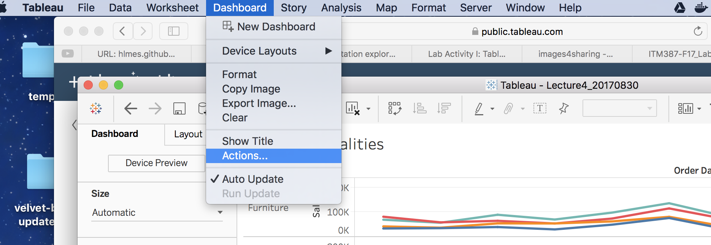
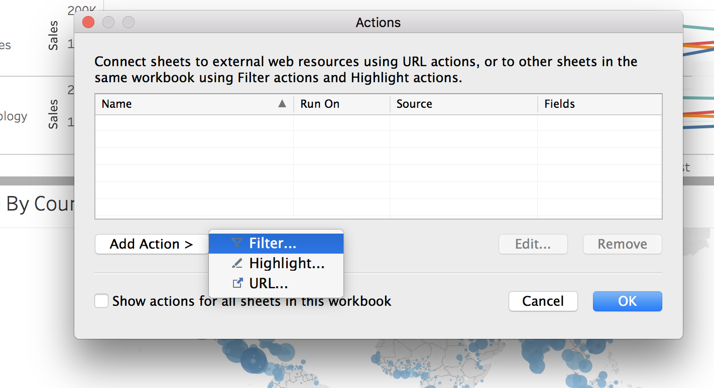
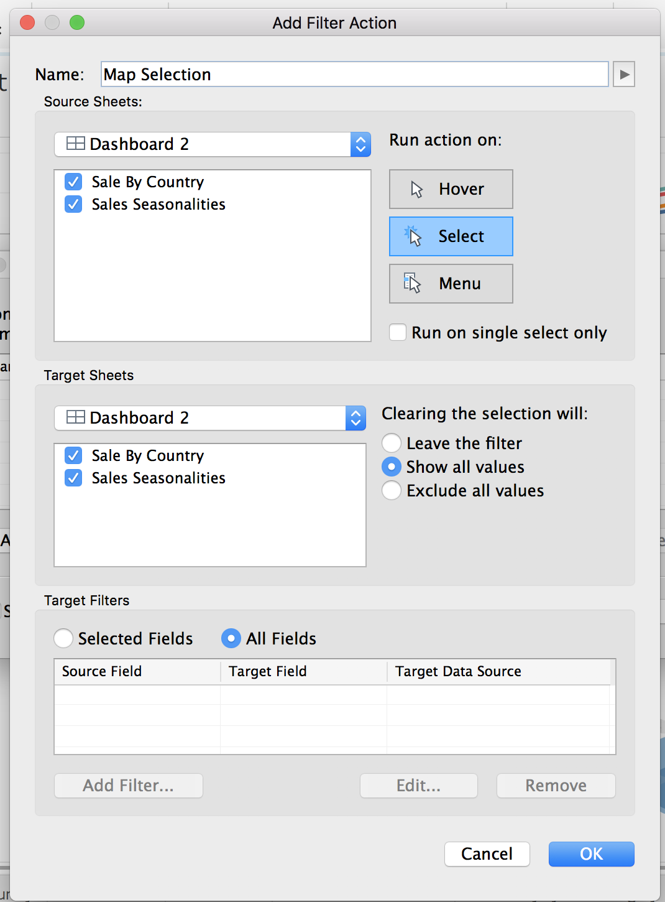
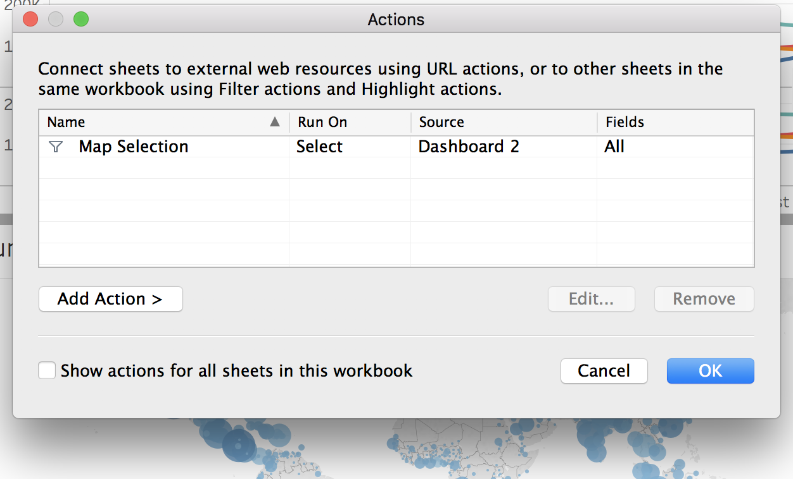
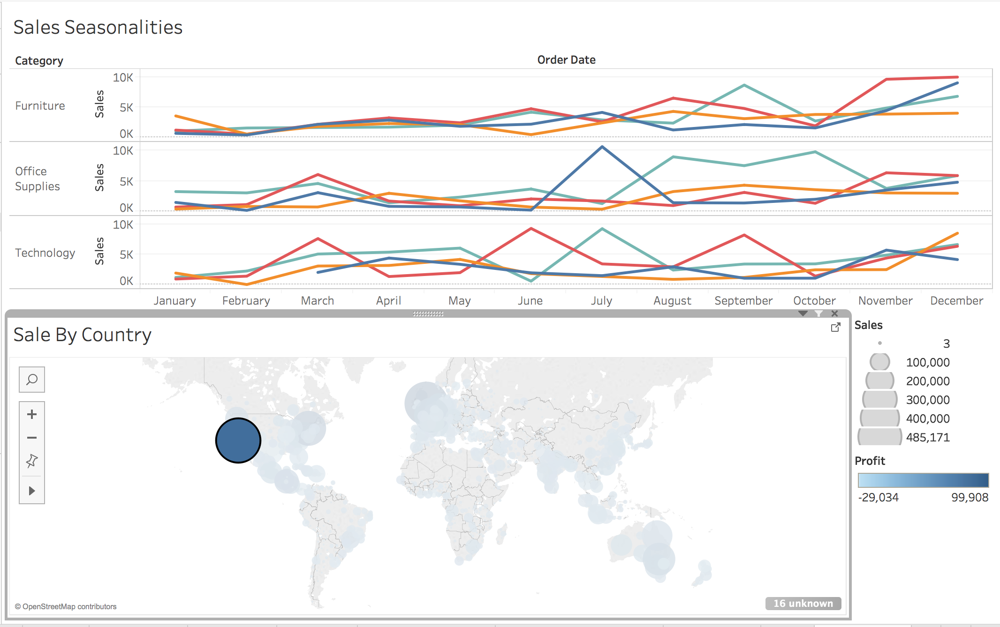

## Quick Demo of Action Filters in Tableau

### Why ?

Although dashboards show be easy to read in 15-30 sec and easy to understand in 30-60 sec, it still needs to be interactive once you have the readers intention.

While you could apply a number of various filters to your sidebar, the idea of directly clicking onto parts of your visualizations (e.g. maps) is one the most natural ways of interactions.

Luckily, we can implement this in Tableau using Actions.

### What ?

Actions are a tool for the dashboard designer make the dashboard more intuitive to use and more effective for drilling into the data. Actions can be used for filtering, highlighting, or linking to URLs, the following considers the filtering option.

Imagine you have a map and want to use that map so that the viewer may click a country/state/city/etc. on the map and then see all (or some) other visualizations update their data based on the selection.

The following steps you through the process of doing it.

### How ?

Simply follow this image sequence.

**Step 1:** Select the action option under Dashboard

**Step 2:** Select `Filter` option under `Add Action`

**Step 3:** Give your action a name and select the action trigger, in this case it's `Select`. You can also customize here which sheets this action should be applied to as sometimes it doesn't make sense to update certain graphs.

**Step 4:** Check that your action was added.

**Step 5:** Successful implementation where the top graph updates based on the selection on the map.

